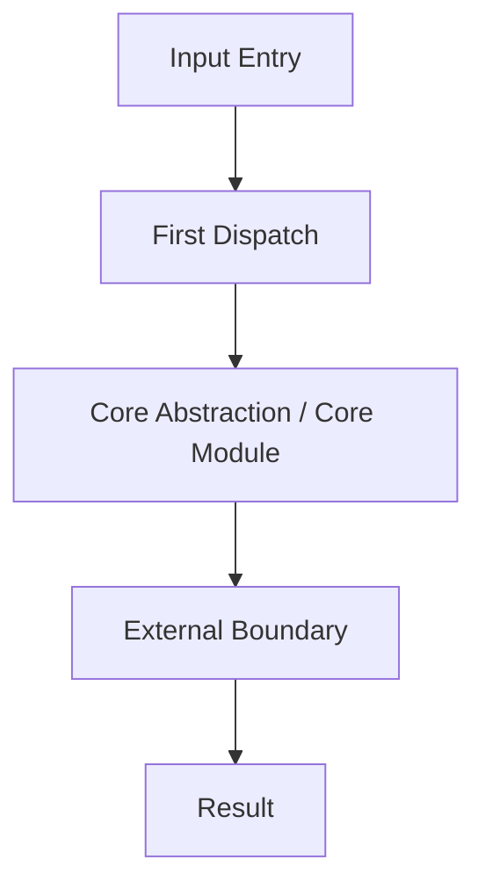

# <Project Name> Source Code Interpretation Report

> Analysis version:
> Analysis date:
> Tech stack:
> Research scope:
> Reference sources & version anchors:
> Deferred scope / known evidence gaps:

## 1. Project Positioning & Core Value

On the surface, this project appears to be a `<technical label>`, but in essence it solves a `<deeper problem>`: it converts `<input or constraint>` into `<stable output or capability>`, and through `<core mechanism>` makes this sustainably extensible.

## 2. Overall Architecture

First provide a general system map, then explain how control authority flows and where complexity is concentrated.

## 3. Core Abstractions & Module System

Only list truly core abstractions and modules. For each, answer:

- Why it exists
- What boundary it controls
- Whether it absorbs complexity or spreads complexity
- What its contract is with other modules
- What key data structures / config / state it depends on
- What its position is in the main flow

It is recommended to first consolidate with a table, then deep-dive 2-4 most critical modules:

| Module / Abstraction | Global Role | Key Boundary | Key Data Structures / State | Adjacent Module Contract | Key Evidence | Judgment Label |
| --- | --- | --- | --- | --- | --- | --- |
|  |  |  |  |  |  | `Fact / Inference / Pending Verification` |

## 4. Key Flow Breakdown

Thoroughly explain at least one main flow. Focus on:

- How input enters the system
- Where the first control handoff happens
- Where core decisions happen
- Where the external world enters the system
- Where key data / state changes occur
- What the key evidence path is for each step

## 5. Design Tradeoff Deep Analysis

Unpack at least 2 to 4 concrete tradeoffs:

| Design Point | Current Approach | Alternative | Benefit | Cost | Judgment |
| --- | --- | --- | --- | --- | --- |
|  |  |  |  |  |  |

## 6. Risks, Problems & Improvement Suggestions

Point out real architecture risks: misplaced complexity, shared layer loss of control, boundary failure, too many implicit conventions, extension mechanisms becoming hard to constrain, etc.

## 7. Patterns Worth Borrowing

Explicitly point out:

- What pattern is worth borrowing
- What prerequisites it suits
- What costs to watch out for when borrowing

## 8. Overall Assessment

Close with one judgmental line: what this system is most worth learning, what to be most vigilant about, where to look next.

## 9. Evidence & Judgment Boundaries (Optional Appendix)

### Key Evidence Path Index

- 

### Inferential Judgments

- 

### Pending Verification

- 
