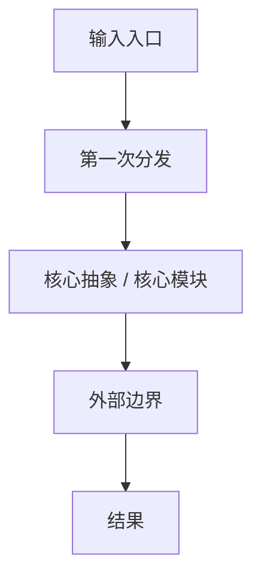

# <项目名> 源码解读报告

> 分析版本：
> 分析日期：
> 技术栈：
> 研究范围：
> 参考来源与版本锚点：
> 暂缓范围 / 已知证据缺口：

## 1. 项目定位与核心价值

这个项目表面上是一个 `<技术标签>`，但本质上是在解决 `<更深层问题>`：它把 `<输入或约束>` 转换成 `<稳定输出或能力>`，并通过 `<核心机制>` 让这件事可以持续扩展。

## 2. 整体架构

先给系统总地图，再解释控制权如何流动、复杂度集中在哪里。

## 3. 核心抽象与模块体系

只列真正核心的抽象和模块。每个都回答：

- 它为什么存在
- 它掌握什么边界
- 它是在吸收复杂度，还是在扩散复杂度
- 它和其他模块的契约是什么
- 它依赖的关键数据结构 / 配置 / 状态是什么
- 它在主流程中的位置是什么

建议用表格先收束，再按 2-4 个最关键模块下钻：

| 模块 / 抽象 | 全局角色 | 关键边界 | 关键数据结构 / 状态 | 相邻模块契约 | 关键证据 | 判断标签 |
| --- | --- | --- | --- | --- | --- | --- |
|  |  |  |  |  |  | `事实 / 推断 / 待验证` |

## 4. 关键流程拆解

至少讲透一条主流程。重点说明：

- 输入如何进入系统
- 第一次控制权切换在哪里
- 核心决策在哪里发生
- 外部世界在哪里进入系统
- 哪些地方发生关键数据 / 状态变化
- 每一步的关键证据路径是什么

## 5. 设计取舍深度解析

至少展开 2 到 4 个具体取舍：

| 设计点 | 当前方案 | 替代方案 | 收益 | 代价 | 判断 |
| --- | --- | --- | --- | --- | --- |
|  |  |  |  |  |  |

## 6. 风险、问题与改进建议

指出真实架构风险：复杂度错位、公共层失控、边界失效、隐式约定过多、扩展机制难约束等。

## 7. 值得借走的模式

明确指出：

- 什么模式值得借
- 它适合什么前提
- 借走时要注意什么代价

## 8. 总体评价

用一句有判断力的话收尾：这套系统最值得学什么，最值得警惕什么，下一步最该看哪里。

## 9. 证据与判断边界（可选附录）

### 关键证据路径索引

- 

### 推断性判断

- 

### 待验证问题

- 
