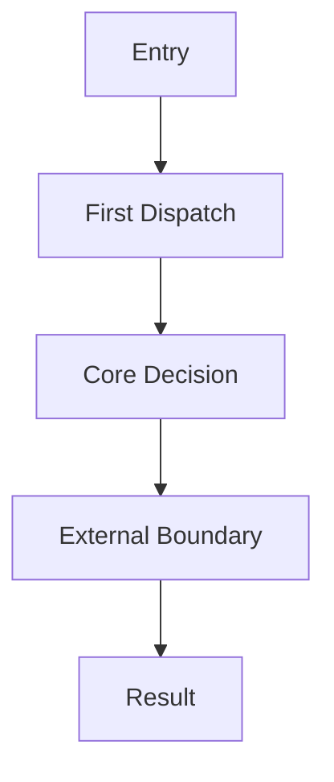

# Main Flow

## Scenario

-

## Boundary Inheritance

- Which round's analysis scope this flow belongs to:
- Sources & version anchors:
- Adjacent boundaries not covered by this flow:

## Mermaid Sketch

## Textual Explanation

1. Where it enters the system
2. Which key modules it passes through
3. Where control flow or data form changes occur
4. Which step best reveals architectural intent
5. Who ultimately produces the result

## Step Evidence Table

| Step | What Happens | Key File / Line | Data / State Change | Contract Object | Judgment Label |
| --- | --- | --- | --- | --- | --- |
| Entry |  |  |  |  | `Fact / Inference / Pending Verification` |
| First Dispatch |  |  |  |  | `Fact / Inference / Pending Verification` |
| Core Decision |  |  |  |  | `Fact / Inference / Pending Verification` |
| External Boundary |  |  |  |  | `Fact / Inference / Pending Verification` |

## Why This Flow Matters Most

- 

## Design Tradeoffs Exposed by This Flow

- 
