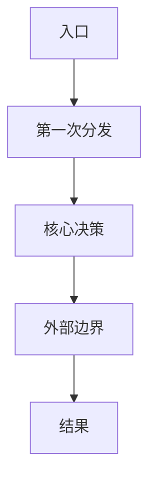

# 主流程

## 场景

-

## Mermaid 草图

```mermaid
flowchart TD
    A[入口] --> B[第一次分发]
    B --> C[核心决策]
    C --> D[外部边界]
    D --> E[结果]
```

## 文字解读

1. 从哪里进入系统
2. 中间经过哪些关键模块
3. 哪些地方发生控制流或数据形态变化
4. 哪个步骤最体现架构意图
5. 最后由谁产出结果

## 为什么这条流程最重要

- 

## 这条流程暴露的设计取舍

- 
