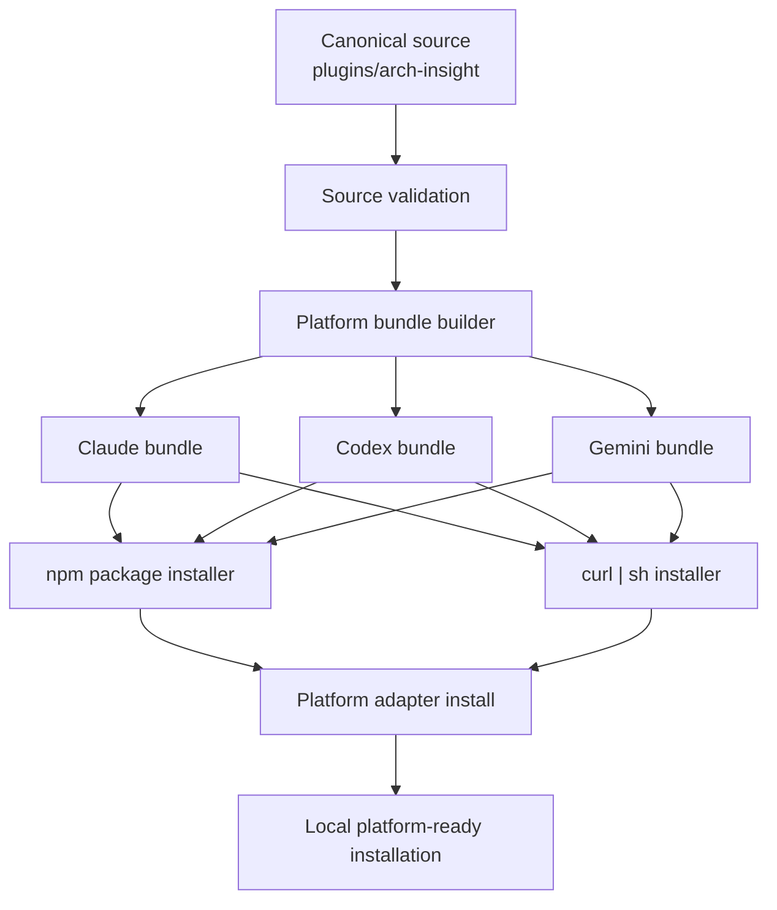

# feat: Productize arch-insight multi-platform skill distribution

## Summary

本计划通过引入一套以 `Claude` 插件结构为中心的权威源、平台产物生成层，以及两条正式安装入口，把 `arch-insight` 从单平台手工搬运状态升级为可发布、可安装、可复用的多平台 skill 仓库。第一阶段聚焦 `Claude`、`Codex`、`Gemini` 三个平台，并同时打通 npm 分发包与独立 `curl | sh` 安装链路。

---

## Problem Frame

源需求文档已经确认，本次工作的核心不是增强 `arch-insight` 的研究方法本身，而是把现有分散资产收束为单一权威源，并建立稳定的多平台安装与分发链路（see origin: docs/brainstorms/2026-05-05-arch-insight-multi-platform-skill-source-and-install-requirements.md）。

当前仓库只有一个面向 `Codex` 的脚本式安装入口，尚未形成统一源、平台产物边界、npm 包骨架或独立发布流程。如果直接在现状上继续叠加平台专用脚本，会把手工搬运问题复制到更多平台。

---

## Requirements

- R1. `arch-insight` 必须建立一套明确的 `Claude 兼容插件` 权威源，作为后续多平台产物的唯一内容来源。
- R2. 该权威源必须能够承载当前 `arch-insight` 的核心 skill 入口与必要提示资产，避免继续以分散材料作为长期分发基线。
- R3. 维护者在更新核心内容时，必须以修改权威源为主路径，而不是分别维护多个平台特定版本。
- R4. 系统必须能够从同一套权威源生成至少 `Claude`、`Codex`、`Gemini` 三个平台可消费的安装产物。
- R5. 第一阶段必须为这三个平台提供自动安装方式，使使用者不再需要手工拷贝 skill 文件或提示资产。
- R6. 生成目标平台产物时，必须保持它们来自同一份权威内容，而不是人工复制后再各自编辑。
- R7. 安装完成后，`arch-insight` 的核心入口必须能够在目标平台上被识别并进入使用路径。
- R8. 第一阶段必须提供一个发布到 npm registry 的统一分发包，供使用者通过 `npx`、`pnpm dlx`、`bunx` 三种方式执行安装。
- R9. 第一阶段必须提供一条独立的 `curl | sh` 安装链路，而且这条链路不能只是对 npm 执行方式的表面包装。
- R10. npm 分发包入口与 `curl | sh` 脚本入口都必须覆盖 `Claude`、`Codex`、`Gemini` 三个平台的安装场景。
- R11. 第一阶段的分发形态必须为维护者和使用者提供统一、可重复执行的正式入口，替代当前零散的手工安装方式。
- R12. 该阶段的验收重点必须是“统一源与三平台自动安装链路成立”，而不是先追求所有平台在运行时能力上的完全等价。

**Origin actors:** A1（skill 维护者）, A2（skill 使用者）, A3（目标 agent 平台）  
**Origin flows:** F1（统一源维护流）, F2（多平台安装流）, F3（多入口分发流）  
**Origin acceptance examples:** AE1（R1/R3/R6）, AE2（R4/R5/R8/R10）, AE3（R5/R9/R10/R11）, AE4（R7/R12）

---

## Scope Boundaries

- 第一阶段只覆盖 `Claude`、`Codex`、`Gemini`，不扩展到 CE 当前其他平台。
- 第一阶段不追求三平台运行时体验、能力映射和扩展能力完全等价。
- 第一阶段不先做完整的升级、卸载、清理、迁移提示与所有 fallback 机制。
- 第一阶段不重写 `arch-insight` 的分析内容方法论，重点是统一源、安装与分发。
- 第一阶段不分别发布多套 `npm`、`pnpm`、`bun` 专用包形态。

### Deferred to Follow-Up Work

- Windows 原生非 POSIX 启动体验：`curl | sh` 第一阶段默认聚焦 POSIX shell 环境。
- 其他平台适配（如 CE 当前更多目标平台）与更深的运行时语义转换。
- 自动升级、自动清理与已安装版本检查的完整产品化。

---

## Context & Research

### Relevant Code and Patterns

- `scripts/install-codex-skill.sh` 已经提供了一个可复用的最小安装器模式：下载归档、校验关键资产、复制到目标目录。
- `README.md` 目前只暴露 `Codex` 的单脚本安装体验，说明现有分发叙事仍然是单平台导向。
- `SKILL.md`、`RUNNER.md`、`prompts/`、`templates/` 已形成完整的 skill 内容资产，但还没有进入插件源结构。
- `docs/plans/2026-05-05-002-feat-context-pack-cli-v1-plan.md` 已经给出过一个适合本仓库的 Node.js CLI 结构模式，可直接借用其“包入口 + src/ + tests/”组织方式。

### Institutional Learnings

- 当前仓库没有现成的 `docs/solutions/` 可复用经验，因此这次计划需要显式定义统一源边界、产物边界和安装边界，避免实现阶段临时发明契约。

### External References

- Gemini CLI extension reference: `https://github.com/google-gemini/gemini-cli/blob/main/docs/extensions/reference.md`
- Gemini CLI extension releasing guide: `https://google-gemini.github.io/gemini-cli/docs/extensions/extension-releasing.html`
- Claude Code CLI reference: `https://docs.anthropic.com/en/docs/claude-code/cli-reference`

---

## Key Technical Decisions

- 权威源直接落在 `plugins/arch-insight/` 下，并以 `.claude-plugin/plugin.json` 作为入口。  
  理由：这满足 R1-R3，也与用户明确选择的 `Claude` 兼容插件结构保持一致。

- 平台安装不直接消费散落的仓库文件，而是统一消费构建出的平台 bundle。  
  理由：这让 R4-R6 有了清晰边界，并允许 npm 包与 `curl | sh` 共享同一批构建产物而不共享安装逻辑。

- npm 分发包和 `curl | sh` 脚本是两条独立入口，但共用同一个 bundle 规范和安装元数据。  
  理由：这样既满足 R8-R10 的“独立链路”要求，又避免两条入口演化成两份内容副本。

- 第一阶段采用 plain Node.js ESM CLI，而不是额外引入 TypeScript 编译链。  
  理由：仓库目前还没有现成的 Node 包骨架，先用更轻的运行时形态建立安装与构建链路，更符合第一阶段的收敛目标。

- 根目录现有 `SKILL.md` 入口在迁移期保留兼容姿态，但不再作为长期权威源。  
  理由：这样可以减少迁移期间对当前使用方式的冲击，同时把维护主路径收回到插件源结构。

---

## Open Questions

### Resolved During Planning

- 统一源放在哪里？  
  结论：放在 `plugins/arch-insight/`，由 `Claude` 插件清单主导。

- 两条安装入口是否各自维护一份内容？  
  结论：不维护内容副本，只共享构建好的平台 bundle 与安装元数据。

- 第一阶段是否值得先引入编译型工具链？  
  结论：不值得，先用 plain Node.js ESM 让结构和分发链路成立。

### Deferred to Implementation

- `Claude`、`Codex`、`Gemini` 三个平台的本地安装优先级细节，最终是“调用原生安装命令”还是“写入平台可消费目录”，需要在实现时按真实环境探测结果定版。
- `curl | sh` 发布物的命名、校验和缓存策略，需要结合最终 release 产物形态在实现阶段确定。

---

## Output Structure

    .
    ├── package.json
    ├── bin/
    │   └── arch-insight.js
    ├── plugins/
    │   └── arch-insight/
    │       ├── .claude-plugin/
    │       │   └── plugin.json
    │       ├── skills/
    │       │   └── arch-insight/
    │       │       └── SKILL.md
    │       ├── RUNNER.md
    │       ├── prompts/
    │       └── templates/
    ├── src/
    │   ├── cli/
    │   │   ├── args.js
    │   │   └── run.js
    │   ├── source/
    │   │   ├── load-plugin-source.js
    │   │   └── validate-plugin-source.js
    │   ├── build/
    │   │   ├── build-bundles.js
    │   │   └── targets/
    │   │       ├── claude.js
    │   │       ├── codex.js
    │   │       └── gemini.js
    │   ├── install/
    │   │   ├── install-bundle.js
    │   │   ├── resolve-platform.js
    │   │   └── targets/
    │   │       ├── claude.js
    │   │       ├── codex.js
    │   │       └── gemini.js
    │   └── release/
    │       ├── build-release-artifacts.js
    │       └── manifest.js
    ├── scripts/
    │   ├── install.sh
    │   └── install-codex-skill.sh
    └── tests/
        ├── cli.spec.js
        ├── plugin-source.spec.js
        ├── bundle-build.spec.js
        ├── npm-install.spec.js
        ├── shell-install.spec.js
        └── release-matrix.spec.js

---

## High-Level Technical Design

> *This illustrates the intended approach and is directional guidance for review, not implementation specification. The implementing agent should treat it as context, not code to reproduce.*

---

## Implementation Units

- U1. **建立 Node 包骨架与统一 CLI 入口**

**Goal:** 为构建、安装和发布链路建立统一的 Node.js 包入口与测试骨架。  
**Requirements:** R8, R11, R12  
**Dependencies:** None

**Files:**
- Create: `package.json`
- Create: `bin/arch-insight.js`
- Create: `src/cli/args.js`
- Create: `src/cli/run.js`
- Test: `tests/cli.spec.js`

**Approach:**
- 建立一个对外唯一的 CLI 入口，承载构建与安装相关子命令。
- 让 npm 包发布、`npx`、`pnpm dlx`、`bunx` 三种执行方式都围绕同一入口工作。
- 把平台选择、源校验、bundle 构建和安装执行拆成独立模块，避免 CLI 本身承担业务逻辑。

**Patterns to follow:**
- 参考 `docs/plans/2026-05-05-002-feat-context-pack-cli-v1-plan.md` 中的 Node CLI 组织方式。

**Test scenarios:**
- Happy path: CLI 默认帮助页能展示构建与安装主入口。
- Edge case: 未提供目标平台或提供未知平台时，返回清晰错误。
- Error path: 缺少权威源或 bundle 产物时，CLI 中止而不是静默继续。
- Integration: `bin/arch-insight.js` 能把参数完整传入 `src/cli/run.js` 并得到一致结果。

**Verification:**
- 仓库具备一个可发布、可测试、可扩展的命令行骨架，后续实现不再依赖散装脚本拼接。

---

- U2. **建立 `Claude` 权威源并迁移核心 skill 资产**

**Goal:** 把现有 `arch-insight` 内容资产收束到单一 `Claude` 插件源结构中。  
**Requirements:** R1, R2, R3, R6  
**Dependencies:** U1

**Files:**
- Create: `plugins/arch-insight/.claude-plugin/plugin.json`
- Create: `plugins/arch-insight/skills/arch-insight/SKILL.md`
- Create: `plugins/arch-insight/RUNNER.md`
- Create: `plugins/arch-insight/prompts/01_repo_intake.md`
- Create: `plugins/arch-insight/prompts/02_design_philosophy_brain_dump.md`
- Create: `plugins/arch-insight/prompts/03_ecosystem_atlas.md`
- Create: `plugins/arch-insight/prompts/04_architecture_report.md`
- Create: `plugins/arch-insight/prompts/05_narrative_article.md`
- Create: `plugins/arch-insight/prompts/06_repo_overview_article.md`
- Create: `plugins/arch-insight/templates/ARCHITECTURE_REPORT.md`
- Create: `plugins/arch-insight/templates/BORROWABLE_PATTERNS.md`
- Create: `plugins/arch-insight/templates/CORE_ABSTRACTIONS.md`
- Create: `plugins/arch-insight/templates/DESIGN_PHILOSOPHY.md`
- Create: `plugins/arch-insight/templates/MAIN_FLOW.md`
- Create: `plugins/arch-insight/templates/NARRATIVE_ARTICLE.md`
- Create: `plugins/arch-insight/templates/REPO_OVERVIEW_ARTICLE.md`
- Create: `plugins/arch-insight/templates/TRADEOFFS.md`
- Modify: `SKILL.md`
- Modify: `README.md`
- Test: `tests/plugin-source.spec.js`

**Approach:**
- 把插件根目录定义成唯一权威源，要求 skill 入口、runner、prompts、templates 都能从该目录出发被打包和安装。
- 保留根目录 `SKILL.md` 的兼容入口，但把维护主路径显式迁移到插件源。
- 在源校验阶段检查插件源是否具备最小可发布资产，避免构建时才发现缺失文件。

**Patterns to follow:**
- 延续当前 `SKILL.md` 与 `RUNNER.md` 的内容契约，不改变 `arch-insight` 的研究方法与交付形态。

**Test scenarios:**
- Covers AE1. Happy path: 插件源包含可识别的 skill 入口、runner、prompts 与 templates。
- Edge case: 缺少任一关键资产时，源校验明确指出缺失项。
- Error path: 根目录兼容入口与插件源内容不一致时，测试能发现漂移。
- Integration: 从插件源读取的 skill 资产可被后续 bundle 构建模块直接消费。

**Verification:**
- 内容维护主路径从分散根目录迁移到单一插件源，且迁移后不丢失现有核心能力。

---

- U3. **实现三平台 bundle 生成层**

**Goal:** 从同一套 `Claude` 权威源生成 `Claude`、`Codex`、`Gemini` 三个平台的可安装 bundle。  
**Requirements:** R4, R6, R7, R10, R12  
**Dependencies:** U2

**Files:**
- Create: `src/source/load-plugin-source.js`
- Create: `src/source/validate-plugin-source.js`
- Create: `src/build/build-bundles.js`
- Create: `src/build/targets/claude.js`
- Create: `src/build/targets/codex.js`
- Create: `src/build/targets/gemini.js`
- Test: `tests/bundle-build.spec.js`

**Approach:**
- 先把权威源解析成统一内存模型，再分别投影成三平台 bundle，避免平台适配直接读写散装文件。
- `Claude` bundle 以原生插件目录为目标形态；`Codex` bundle 补充 `.codex-plugin/plugin.json` 与目标技能布局；`Gemini` bundle 生成 `gemini-extension.json` 与所需扩展结构。
- bundle 生成结果必须是确定性的，确保两条安装入口都能消费同一批产物。

**Patterns to follow:**
- 延续 `scripts/install-codex-skill.sh` 中“先验证资产，再复制到目标”的安全姿态。

**Test scenarios:**
- Covers AE2. Happy path: 同一套源可稳定生成三平台 bundle，且每个平台都有可识别的入口清单文件。
- Edge case: 源内容包含平台不支持的结构时，构建阶段给出目标平台级别错误。
- Error path: 构建目标未知或源清单不完整时，不产出半成品 bundle。
- Integration: 三平台 bundle 对同一 skill 内容给出一致的版本与核心入口标识。

**Verification:**
- 仓库形成清晰的“统一源 -> 平台 bundle”边界，安装器不再依赖手工散装复制。

---

- U4. **实现 npm 分发包安装链路**

**Goal:** 提供一个发布到 npm registry 的统一分发包，支撑 `npx`、`pnpm dlx`、`bunx` 三种安装入口。  
**Requirements:** R5, R8, R10, R11, R12  
**Dependencies:** U1, U3

**Files:**
- Create: `src/install/resolve-platform.js`
- Create: `src/install/install-bundle.js`
- Create: `src/install/targets/claude.js`
- Create: `src/install/targets/codex.js`
- Create: `src/install/targets/gemini.js`
- Modify: `src/cli/run.js`
- Test: `tests/npm-install.spec.js`

**Approach:**
- 让 npm 分发包内置或携带可定位的 bundle 产物与安装元数据，安装时不再访问仓库散装文件。
- 平台安装适配器负责解析目标平台、准备临时 staging 目录、执行本地安装动作并暴露清晰错误。
- 安装器优先与平台原生安装模型对齐；当原生 handoff 不可用时，再执行文件系统级别的本地安装。

**Execution note:** 先为平台解析与 bundle 定位写失败用例，再实现真实安装适配，以便防止安装流程在未知平台上静默落入错误路径。

**Patterns to follow:**
- 参考 `README.md` 当前的“一键安装”叙事，但升级为统一 CLI 入口而不是单平台脚本。

**Test scenarios:**
- Covers AE2. Happy path: 通过统一 CLI 选择 `Claude`、`Codex`、`Gemini` 中任一平台时，安装器能定位正确 bundle 并完成目标安装。
- Edge case: 平台已安装旧版本或目标目录已存在时，安装器给出明确覆盖策略。
- Error path: 平台运行时缺少必要前提时，安装器中止并输出可操作提示。
- Integration: 三种包执行方式共享同一安装逻辑，不因执行器不同而走出不同产物路径。

**Verification:**
- npm registry 分发包成为三种 JavaScript 包执行方式的统一安装入口，而不是仅适配某一个包管理器。

---

- U5. **实现独立 `curl | sh` 安装链路与 release 产物**

**Goal:** 提供不依赖 npm 执行方式的独立 shell 安装链路，并让它消费正式 release 产物。  
**Requirements:** R5, R9, R10, R11  
**Dependencies:** U3

**Files:**
- Create: `src/release/build-release-artifacts.js`
- Create: `src/release/manifest.js`
- Create: `scripts/install.sh`
- Modify: `scripts/install-codex-skill.sh`
- Test: `tests/shell-install.spec.js`

**Approach:**
- 由 release 产物生成步骤输出 shell 安装可消费的 bundle 集合与元数据清单。
- `curl | sh` 脚本独立解析目标平台、拉取对应 release 产物、校验关键资产并执行安装，禁止把 npm CLI 当成内部依赖。
- 现有 `scripts/install-codex-skill.sh` 要么被折叠进新的脚本体系，要么明确转为兼容包装并标注迁移方向。

**Patterns to follow:**
- 继承 `scripts/install-codex-skill.sh` 已验证过的 tarball 下载、校验和复制模式。

**Test scenarios:**
- Covers AE3. Happy path: 不依赖 npm 环境时，shell 链路也能为三平台中的任一目标完成安装。
- Edge case: 未指定目标平台或指定不受支持平台时，脚本快速失败。
- Error path: release 产物缺失、校验失败或下载中断时，脚本不留下部分安装状态。
- Integration: shell 链路与 npm 链路安装到同一平台时，得到同构的最终 bundle 结果。

**Verification:**
- `curl | sh` 成为真正独立的正式入口，而不是 npm 安装命令的包装层。

---

- U6. **补齐文档、迁移说明与端到端验证矩阵**

**Goal:** 把新的统一源、bundle、npm 安装链和 shell 安装链变成可理解、可验证、可发布的产品形态。  
**Requirements:** R5, R7, R11, R12  
**Dependencies:** U2, U3, U4, U5

**Files:**
- Modify: `README.md`
- Modify: `SKILL.md`
- Create: `tests/release-matrix.spec.js`
- Test: `tests/release-matrix.spec.js`

**Approach:**
- 更新 README，让用户一眼看到三平台、两条安装入口和最小使用路径。
- 明确说明根目录兼容入口与插件源之间的关系，降低迁移混乱。
- 建立一个面向临时 home / 临时工作目录的端到端验证矩阵，覆盖“三平台 x 两条安装入口”的最小成功面。

**Patterns to follow:**
- 延续当前 README 的“先给最短安装路径，再解释产品定位”的写法。

**Test scenarios:**
- Covers AE4. Happy path: 三个平台在 bundle 安装完成后都能暴露 `arch-insight` 核心入口。
- Edge case: 仅更新权威源、未重新生成 bundle 时，验证矩阵能发现发布物过期。
- Error path: 旧的单平台入口仍指向过期流程时，文档或测试能阻止其继续作为默认路径。
- Integration: 三平台与两条安装入口的最小矩阵都能在隔离环境中完成一次成功安装。

**Verification:**
- 新分发方案不只是“代码存在”，而是有文档、有迁移说明、也有最小端到端验收面。

---

## System-Wide Impact

- **Interaction graph:** 权威源、bundle 构建器、npm CLI、shell 安装器和三个平台适配器之间会形成新的核心分发主链。
- **Error propagation:** 源校验失败应在构建前暴露；bundle 缺失应在安装前暴露；平台安装失败应带目标平台上下文返回。
- **State lifecycle risks:** 生成产物与权威源漂移、安装中断后的半写入状态、旧 `Codex` 脚本与新入口并存带来的误用风险。
- **API surface parity:** npm 与 shell 两条入口必须共享同样的平台命名、版本来源和 bundle 识别语义。
- **Integration coverage:** 需要用隔离目录验证三平台安装、重复安装、旧入口迁移与 bundle 过期场景。
- **Unchanged invariants:** `arch-insight` 的分析方法、交付形态和核心提示资产语义在第一阶段不应发生产品层变更。

---

## Risks & Dependencies

| Risk | Mitigation |
|------|------------|
| 平台安装契约在现实环境中与预期不一致 | 让平台适配器显式分层，并把原生命令 handoff 与目录安装作为可切换策略验证 |
| 权威源迁移后出现双份内容漂移 | 用 `tests/plugin-source.spec.js` 和 release 矩阵把源与产物一致性纳入回归面 |
| `curl | sh` 入口退化为 npm 包包装 | 在 shell 适配器测试中明确断言不依赖 npm 可执行链 |
| 旧 `Codex` 安装脚本继续成为默认路径 | 在 README、兼容脚本和验证矩阵里都显式迁移到新入口 |
| 发布产物过大或不完整 | 通过 release 产物生成步骤和内容清单测试收紧发布边界 |

---

## Alternative Approaches Considered

- 保持根目录 `SKILL.md` 体系为权威源，再额外叠加三平台脚本。  
  未选原因：这会把当前“分散资产 + 手工拼装”的问题复制到更多入口，无法满足 R1-R3。

- 先建立一套中立 manifest，再反向生成 `Claude` 源结构。  
  未选原因：用户已明确要求 `Claude` 兼容插件结构作为第一权威源，先抽象中立层会扩大第一阶段范围。

---

## Documentation / Operational Notes

- npm 包版本、插件 manifest 版本与 release 产物版本需要在同一发布流程里同步。
- `curl | sh` 发布链路需要一个稳定的 release 托管位置和可追踪的 bundle 清单。
- README 需要从“Codex 一键安装”升级为“多平台 + 双入口安装”，同时保留迁移提示。

---

## Sources & References

- **Origin document:** [docs/brainstorms/2026-05-05-arch-insight-multi-platform-skill-source-and-install-requirements.md](docs/brainstorms/2026-05-05-arch-insight-multi-platform-skill-source-and-install-requirements.md)
- Related code: [README.md](README.md)
- Related code: [SKILL.md](SKILL.md)
- Related code: [scripts/install-codex-skill.sh](scripts/install-codex-skill.sh)
- Related plan: [docs/plans/2026-05-05-002-feat-context-pack-cli-v1-plan.md](docs/plans/2026-05-05-002-feat-context-pack-cli-v1-plan.md)
- External docs: `https://github.com/google-gemini/gemini-cli/blob/main/docs/extensions/reference.md`
- External docs: `https://google-gemini.github.io/gemini-cli/docs/extensions/extension-releasing.html`
- External docs: `https://docs.anthropic.com/en/docs/claude-code/cli-reference`
