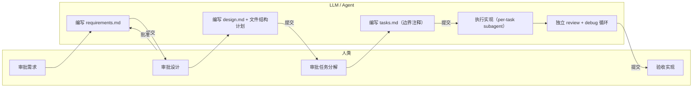
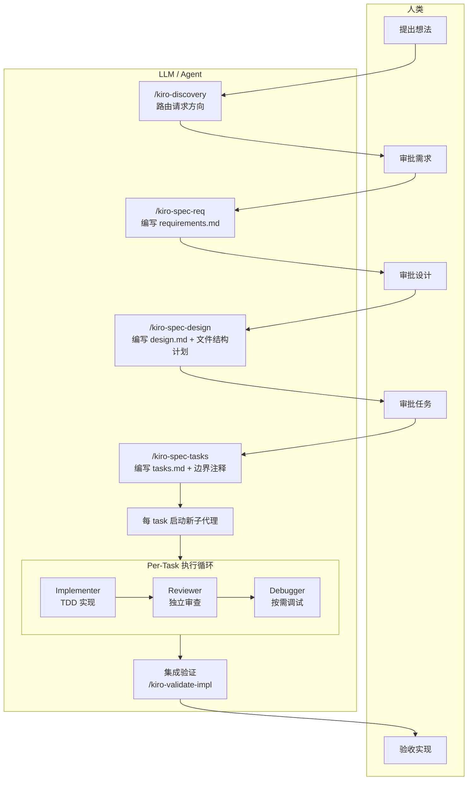
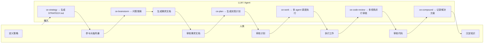
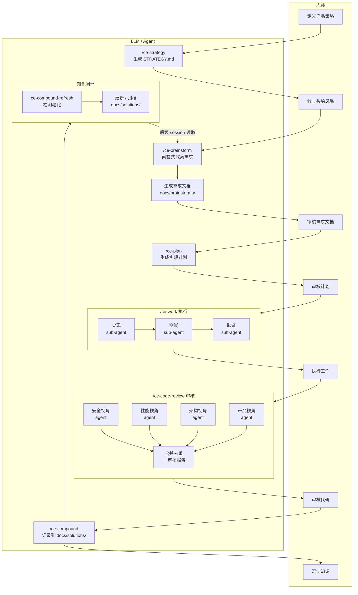
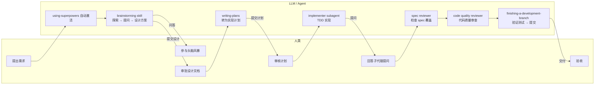
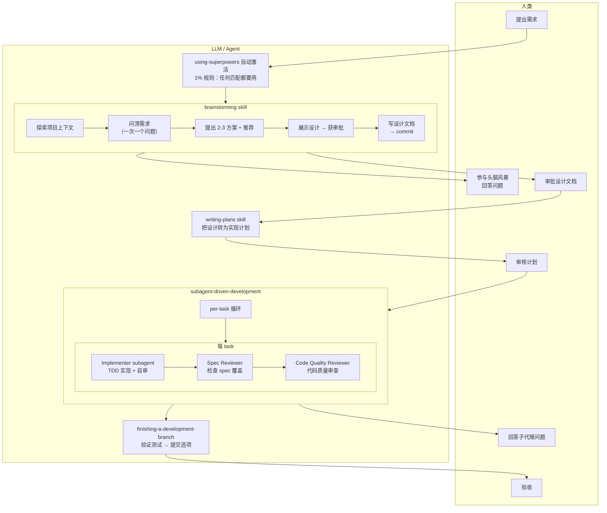
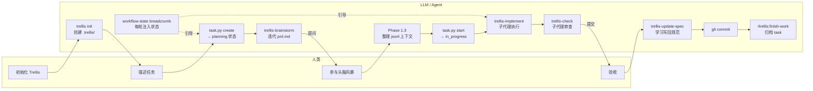
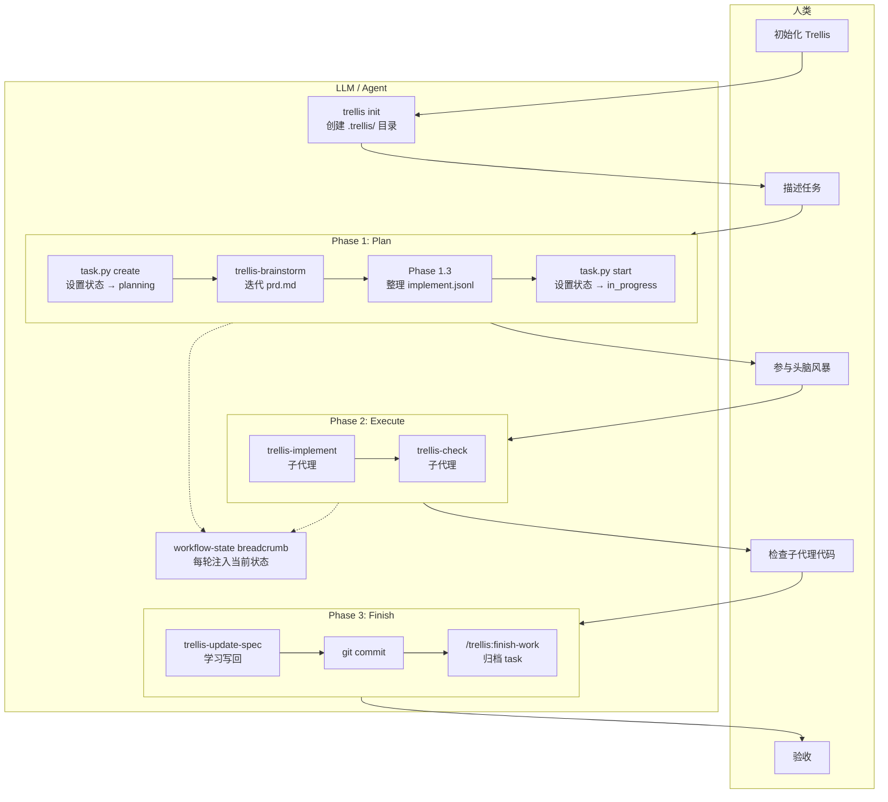
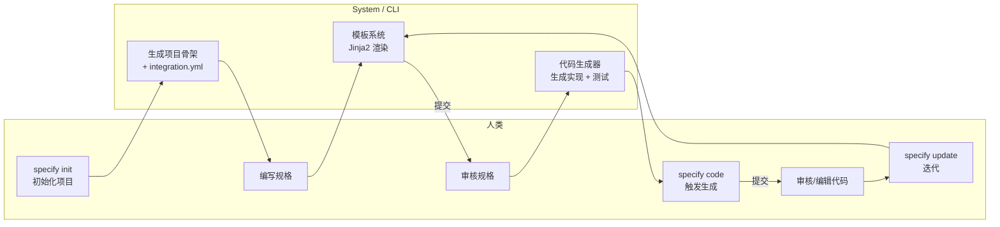
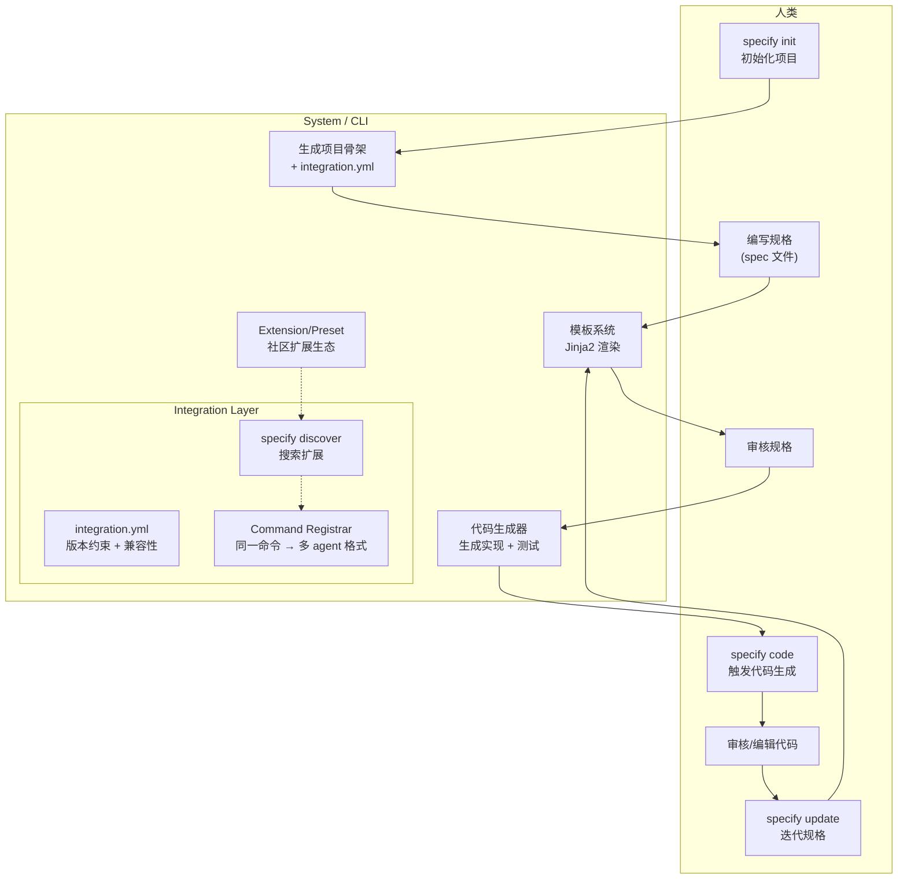

# Deep Comparative Analysis of Five LLM Coding Assistant Workflows

> Analysis targets: cc-sdd / Compound Engineering / Superpowers / Trellis / Spec Kit  
> Analysis goal: Extract how they collaborate with LLMs for project code development, providing reference for designing new workflows  
> Analysis date: 2026-05-06

---

## 1. Scope and Methodology

### 1.1 Research Targets

This analysis covers five open-source projects under `/Users/lienli/Documents/GitHub/vibe-ref/`, each being an "AI coding assistant workflow system" — they orchestrate **how LLMs and humans collaborate** through mechanisms such as skills, agents, commands, and templates.

| Project | Positioning | Platform Coverage | Code Size / Complexity |
| --- | --- | --- | --- |
| **cc-sdd** | Spec-driven long-cycle autonomous implementation system | 8 platforms | Medium (multi-template generation) |
| **Compound Engineering** | Compound engineering skill system | Multi-platform (Claude primary) | Largest (50+ agents, 38+ skills) |
| **Superpowers** | Skill-driven development methodology | Multi-platform | Medium (16 skills) |
| **Trellis** | Team-level AI coding harness | Multi-platform + CLI | Large (CI + scripts + spec system) |
| **Spec Kit** | Extensible SDD platform tool | Multi-platform + Python CLI | Medium (extension ecosystem) |

### 1.2 Analysis Dimensions

This analysis compares the five projects' collaboration mechanisms across the following dimensions:

1. **Workflow orchestration**: How the phases and sequence of "human → LLM" collaboration are organized
2. **Skill/capability encapsulation**: How LLM interactions are encapsulated into reusable capability units
3. **Sub-agent mechanisms**: How sub-agents are used for parallel/serial task execution
4. **Context management**: How project knowledge is managed within LLM's limited context window
5. **Knowledge accumulation**: How experience from one session is learned for reuse
6. **Quality assurance**: How quality is ensured in LLM-generated code
7. **Cross-platform strategy**: How the same workflow runs across multiple coding assistants

---

## 2. Core Comparison Tables

### 2.1 Workflow Orchestration

| Dimension | cc-sdd | Compound Engineering | Superpowers | Trellis | Spec Kit |
| --- | --- | --- | --- | --- | --- |
| **Entry Point** | `/kiro-discovery` | `/ce-brainstorm` or `/ce-ideate` | Auto-triggered skills | Auto-trigger / Command-triggered | `specify init` |
| **Phases** | Discovery → Spec → Design → Tasks → Impl | Strategy → Ideate → Brainstorm → Plan → Work → Review → Compound | Brainstorm → Plan → Exec → Review → Finish | Plan → Execute → Finish | Requirements → Design → Code → Test |
| **Human Intervention** | Approval at each phase | Approval at each phase / skippable | Design approval + final review | Task level | Approval between phases |
| **Enforced Order** | Yes (phase gate) | Yes (skill chain) | Yes (steps within skill) | Yes (workflow-state) | Yes (phase gate) |
| **Exception Handling** | auto-debug loop | ce-debug independent skill | Stop and ask for help | trellis-break-loop | Not specified |

### 2.2 Skill/Capability Encapsulation

| Dimension | cc-sdd | Compound Engineering | Superpowers | Trellis | Spec Kit |
| --- | --- | --- | --- | --- | --- |
| **Encapsulation Unit** | SKILL.md | SKILL.md | SKILL.md | Commands + agents + scripts | Templates + integration |
| **Trigger Method** | Slash commands | Slash commands | Auto-matching (even 1%) | Commands + injection | CLI commands |
| **Dependency Management** | Steering documents | Reference files | File references | JSONL context injection | extension.yml |
| **Composability** | skill → skill call | skill → agent call | skill → skill reference | agent → agent scheduling | Template composition |
| **Granularity** | spec/impl/validate level | Full feature coverage (fine-grained) | Process step level | Agent level | Project level |

### 2.3 Sub-agent Mechanisms

| Dimension | cc-sdd | Compound Engineering | Superpowers | Trellis | Spec Kit |
| --- | --- | --- | --- | --- | --- |
| **Scheduling** | Dynamic dispatch (within skill) | Static agent files + dynamic scheduling | Static prompt templates | Static agent files | N/A (CLI tool) |
| **Roles per Task** | Implementer + Reviewer + Debugger | 50+ specialized agents | Implementer + Spec Reviewer + Code Reviewer | trellis-implement + trellis-check + trellis-research | N/A |
| **Parallel Strategy** | Batch spec parallel creation | Parallel reviewer agents | Sub-agents serial per task | Sub-agents default dispatch | N/A |
| **Review Mechanism** | Independent reviewer (adversarial) | Multi-persona parallel review | Two-step review (spec → quality) | trellis-check agent | N/A |
| **Failure Retry** | Max 2 debug rounds | Via ce-debug skill | BLOCKED + ask for help | break-loop agent | N/A |
| **Learning Transfer** | `## Implementation Notes` in tasks.md | Depends on knowledge accumulation chain | Not specified | spec update (Phase 3.3) | N/A |

### 2.4 Context Management

| Dimension | cc-sdd | Compound Engineering | Superpowers | Trellis | Spec Kit |
| --- | --- | --- | --- | --- | --- |
| **Long-term Memory** | Steering files | docs/solutions/ learning notes | docs/superpowers/ plans + specs | .trellis/spec/ standards system | specs/ directory |
| **Session Memory** | brief.md + roadmap.md | session inventory | No persistence | workspace journal + index | N/A |
| **Context Injection** | Dynamic steering → subagent | File reading on call | Subagent prompt templates + live info | implement.jsonl / check.jsonl | N/A |
| **Workflow State** | spec.json metadata | Protocol within skill SKILL.md | Step list within SKILL.md | workflow-state breadcrumb protocol | Filesystem state |
| **Current Task Tracking** | spec status command | Task table | TodoWrite | task.py create/start/finish/archive | N/A |

### 2.5 Knowledge Accumulation

| Dimension | cc-sdd | Compound Engineering | Superpowers | Trellis | Spec Kit |
| --- | --- | --- | --- | --- | --- |
| **Active Learning** | Implementation Notes propagation | ce-compound → docs/solutions/ | Retrospective in finishing skill | spec update (Phase 3.3) | Template solidification |
| **Cross-session** | Steering files | Yes (docs/ + memory files) | No | workspace journal + index | N/A |
| **Learning Type** | Boundary/contract errors | Problem solving (patterns + solutions) | Not specified | Standards (code standards + workflow) | Templates / best practices |
| **Refresh Mechanism** | N/A | ce-compound-refresh | N/A | spec update | Versioned templates |

---

## 3. Detailed Analysis of Each Project's Collaboration Model

### 3.1 cc-sdd: Contract-Driven Autonomous Execution

#### Core Philosophy

cc-sdd treats **spec as a contract between parts of the system**, not as a "command document" for agents. Within boundaries, agents have free rein; between boundaries, coordination relies on explicit contracts.

#### Division of Responsibilities Between Human and LLM



#### Flowchart



#### Key Design Decisions

1. **Boundary-First**: `design.md` includes a `File Structure Plan`, each task has `_Boundary:_` and `_Depends:_` annotations, and review checks for boundary violations (not just style).
2. **Per-Task Three-Role Closed Loop**: Each task independently starts implementer → reviewer → debugger (on demand), without sharing context to avoid contamination.
3. **Learning Propagation**: Cross-cutting knowledge discovered in a previous task is written to `## Implementation Notes` in `tasks.md` and injected into subsequent implementer prompts.
4. **Interruptible Reruns**: Only 1 task is processed per round; on interruption, reruns continue from the breakpoint without losing progress.

#### Limitations

- High spec writing cost, unsuitable for rapid prototyping or single-task work
- Over-reliance on human-in-the-loop (approval at every phase) in some scenarios
- Cross-spec coordination depends on `/kiro-spec-batch` and cross-spec review, adding complexity

### 3.2 Compound Engineering: Compound Skill Ecosystem

#### Core Philosophy

**Every engineering effort should make subsequent work easier**, not harder. 80% in planning and review, 20% in execution. The compounding effect of skills and agents enables continuous accumulation of team knowledge.

#### Division of Responsibilities Between Human and LLM



#### Flowchart



### 3.3 Superpowers: Process-Discipline-Driven Development Methodology

#### Core Philosophy

Agents default to "jumping straight into writing code" — Superpowers prevents this through forced skill activation and process discipline (design first → plan next → execute with sub-agents → review).

#### Division of Responsibilities Between Human and LLM



#### Flowchart



### 3.4 Trellis: Team-Level Context and Task Management System

#### Core Philosophy

Use a structured file system to supplement the LLM's limited context window. The `.trellis/` directory stores all project knowledge, providing on-demand context loading for agents through the breadcrumb protocol and JSONL injection.

#### Division of Responsibilities Between Human and LLM



#### Flowchart



### 3.5 Spec Kit: Extensible SDD Platform Tool

#### Core Philosophy

**Platformizing Spec-Driven Development (SDD)**. Specifications become executable — specs are not just guidance but directly generate working implementations. The core is the `specify` CLI tool and an extensible extension/preset system.

#### Division of Responsibilities Between Human and LLM



#### Flowchart



---

## 4. Core Design Tradeoff Comparison

### 4.1 Process Rigidity vs Flexibility

| Flexible (no process) | | | Rigid (highly structured) |
| Spec Kit (CLI tool) | Superpowers (forced skill) / Trellis (state machine) | Compound (flexible skill chain) | cc-sdd (phase gate) |

- **cc-sdd** is the most rigid: discovery → spec → design → tasks → impl, each phase requires approval, cannot skip without `-y`
- **Superpowers** enforces skills but allows flexibility in steps within a skill
- **Compound Engineering** provides a full skill chain but allows entry from any point
- **Trellis** guides via workflow-state protocol but provides inline override escape hatches
- **Spec Kit** is a CLI tool, process is user-controlled

### 4.2 Context Management Complexity

| No persistence | Filesystem-based | Full persistence + state machine |
| Superpowers | cc-sdd / Compound (medium) | Trellis (highest) |

- **Superpowers** relies entirely on subagent prompt templates, no cross-session memory
- **cc-sdd** uses steering files and Implementation Notes to transfer knowledge
- **Compound Engineering** manages knowledge through docs/solutions/ and memory system
- **Trellis** uses `.trellis/` directory, workspace journal, jsonl context, and breadcrumb protocol for the most complete persistence

### 4.3 Sub-agent Complexity

| No sub-agents | Simple sub-agents | Complex agent system |
| Spec Kit | Superpowers (3 roles) | cc-sdd (3 roles) / Compound Engineering (50+ agents) / Trellis (3 agents + scripts) |

- **Compound Engineering** has the most agents (50+), but most are for code review scenarios
- **cc-sdd** and **Superpowers** both use 3 roles per-task (implementer + reviewer + debug/quality)
- **Trellis** uses 3 sub-agents supplemented by scripts
- The more sub-agents, the greater the overhead of context transfer and coordination

### 4.4 Knowledge Accumulation Mechanisms

| No accumulation | One-way accumulation | Closed-loop accumulation + refresh |
| Superpowers | cc-sdd | Trellis (spec update) | Compound Engineering (ce-compound + refresh) |

- **Compound Engineering**'s `ce-compound` + `ce-compound-refresh` combination is the only system with **knowledge aging detection**
- **Trellis**'s `spec update` in Phase 3.3 is required, writing learned standards back to `.trellis/spec/`
- **cc-sdd**'s Implementation Notes only propagate within a single session
- **Superpowers** has no knowledge accumulation mechanism

---

## 5. Implications for New Workflow Design

### 5.1 Key Mechanisms Worth Adopting

| Mechanism | Source | Reason for Adoption |
| --- | --- | --- |
| **workflow-state breadcrumb protocol** | Trellis | Achieves state awareness in the lightest way (text labels), agent doesn't need to maintain a state machine |
| **Boundary-First task decomposition** | cc-sdd | Core method for solving agent context pollution within a single session |
| **Even 1% skill activation** | Superpowers | Effective mechanism to prevent agents from "jumping straight into writing code" |
| **Multi-persona parallel code review** | Compound Engineering | Covers single-perspective blind spots in agent code with different viewpoints |
| **JSONL context injection** | Trellis | Main thread doesn't load spec details; sub-agents fetch on demand |
| **Three-role closed loop per task** | cc-sdd / Superpowers | Separation of implementation + review + debug ensures quality |
| **Document compounding system** | Compound Engineering | Knowledge accumulation with aging detection truly persists over time |
| **Cross-platform skill templates** | cc-sdd / Compound | Adapts the same workflow to multiple coding assistants |

### 5.2 Pitfalls to Avoid

| Pitfall | Source | Description |
| --- | --- | --- |
| **Over-engineered state management** | Trellis | State machine complexity can cause agent misunderstanding (4 states + 5 phases + 3 step types) |
| **Skill count inflation** | Compound Engineering | 50+ agents increase maintenance costs and user confusion |
| **Process without persistence** | Superpowers | Knowledge doesn't accumulate across sessions, starting from scratch each time |
| **High spec writing cost** | cc-sdd | Small changes don't warrant a full spec process |
| **Forcing all changes through the full process** | Superpowers | The "This Is Too Simple To Need A Design" anti-pattern, while correct, may slow prototyping speed |

### 5.3 Key Characteristics of an "Ideal Workflow"

Synthesizing the analysis of all five projects, a new workflow should have the following characteristics:

1. **State explicit but lightweight**: Use text labels/filesystem state, not complex state machines
2. **Progressive process**: From "immediate execution" to "full spec" enabled on demand, not one-size-fits-all
3. **Sub-agent isolation**: Each sub-agent has independent context to avoid contamination
4. **Knowledge lifecycle**: accumulate (compound) → use (work) → refresh (refresh) → archive (archive)
5. **Human intervention at key nodes**: Design approval, acceptance review, not line-by-line code review
6. **Interrupt recovery support**: Each step's operation is persisted; resume from breakpoints after interruption
7. **Observability**: What agents do, why, and what state they're in, can all be traced from files

### 5.4 Recommended Workflow Meta-Model

```
┌─────────────────────────────────────────────────────────────────┐
│                    Strategy Layer (cross-session)                 │
│  ┌──────────┐    ┌──────────┐    ┌──────────┐                  │
│  │ STRATEGY │◄──►│ LEARNINGS│◄──►│ STANDARDS│                  │
│  │ .md      │    │ docs/    │    │ .trellis/│                  │
│  └──────────┘    └──────────┘    └──────────┘                  │
└─────────────────────────────────────────────────────────────────┘
                            │ Read
┌─────────────────────────────────────────────────────────────────┐
│                    Execution Layer (single session)               │
│                                                                  │
│  Entry Decision ←──────── User Input                             │
│    │                                                             │
│    ├── Direct Change (small fix) → TDD → review → commit         │
│    │                                                             │
│    ├── Spec Development: Clarify requirements → Plan → Task breakdown
│    │              → per-task [impl → review] loop                 │
│    │              → Integration verification → commit             │
│    │                                                             │
│    └── Debug Mode: Reproduce → Causal chain trace → fix → verify │
│                                                                  │
│  Each step's state persisted to filesystem (interrupt-resumable) │
└─────────────────────────────────────────────────────────────────┘
                            │ Learn
┌─────────────────────────────────────────────────────────────────┐
│                    Accumulation Layer (post-session)               │
│  ┌──────────┐    ┌──────────┐    ┌──────────┐                  │
│  │ Compound  │──►│ Refresh   │──►│ Archive   │                  │
│  │ compound │    │ refresh  │    │ archive  │                  │
│  └──────────┘    └──────────┘    └──────────┘                  │
└─────────────────────────────────────────────────────────────────┘
```

---

## 6. Conclusion

### 6.1 Each Project's Unique Contribution

- **cc-sdd**: Most clearly articulates the "spec = contract" philosophy, solving the coordination problem of AI-generated code
- **Compound Engineering**: Most complete skill ecosystem, the strategy → pulse closed loop enables flywheel-driven development
- **Superpowers**: Strongest emphasis on process discipline, the "Even 1%" rule is an effective measure against the agent's urge to "jump straight into writing code"
- **Trellis**: Most comprehensive context management solution, the combination of breadcrumb protocol + JSONL injection + workspace journal is worth deep reference
- **Spec Kit**: The only platform-ecosystem approach, the extension/preset mechanism makes SDD tools extensible

### 6.2 Core Insight

> **The core tension in LLM coding assistant workflows is: process discipline improves quality but increases friction; freedom improves speed but reduces controllability.**

All five projects are seeking different balance points. There is no "best" solution, only solutions suitable for specific teams and project types.

- For solo prototyping: Superpowers' lightweight skill chain may be most suitable
- For medium teams: Compound Engineering's complete ecosystem is most comprehensive
- For teams needing long-cycle execution: cc-sdd's boundary-first + autonomous execution is most suitable
- For team standardization: Trellis's context and standards management system is most mature
- For code generation toolchains: Spec Kit's template platform is most extensible

### 6.3 Next Steps

The output of this analysis will feed into the design of `vibe-workflow`, specifically:

1. Extract the "core workflow meta-model" (see 5.4)
2. Determine the state protocol (drawing from Trellis breadcrumb, but lighter)
3. Design the sub-agent scheduling strategy (drawing from cc-sdd's per-task three-role + Compound's multi-persona review)
4. Design the knowledge accumulation system (drawing from Compound's compound + refresh mechanism)
5. Build the cross-platform adaptation layer (drawing from cc-sdd and Compound's cross-platform template generation)