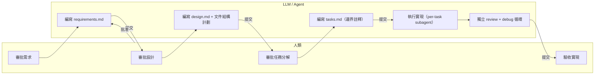
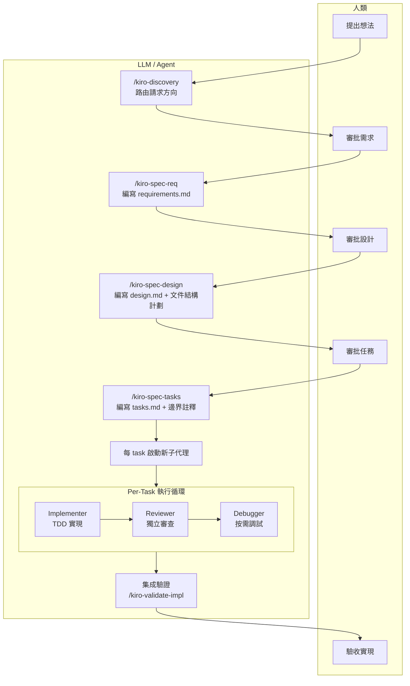
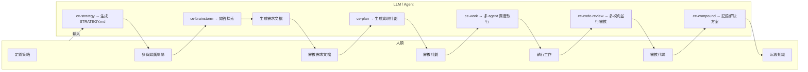
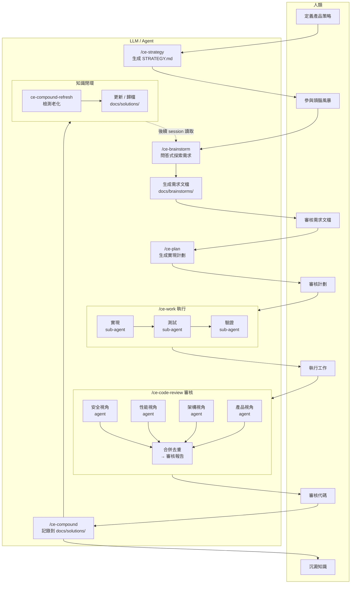
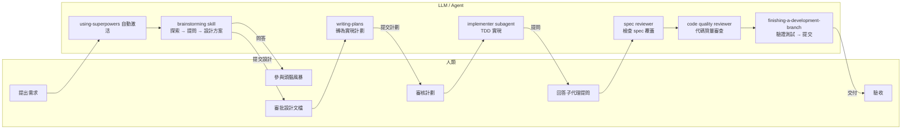
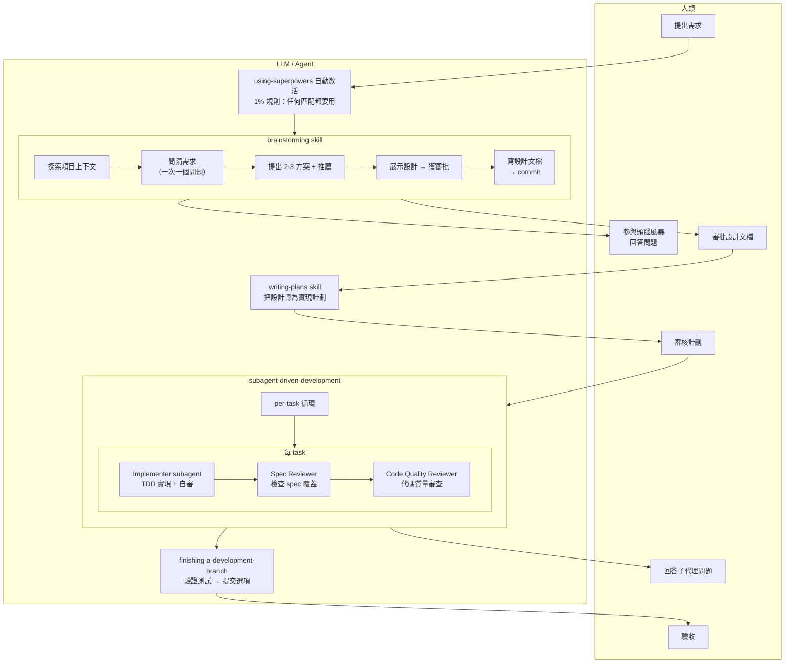
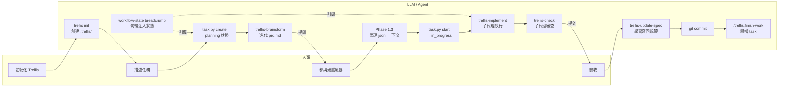
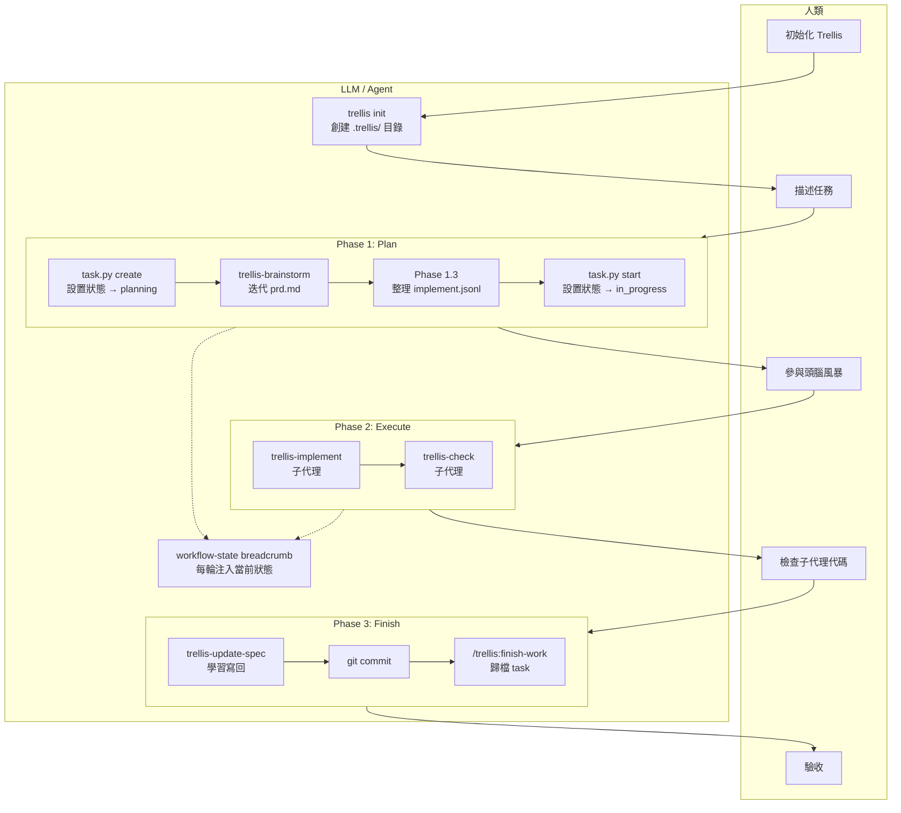
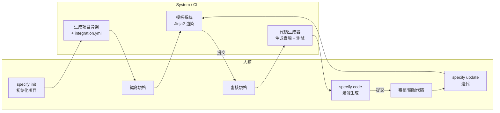
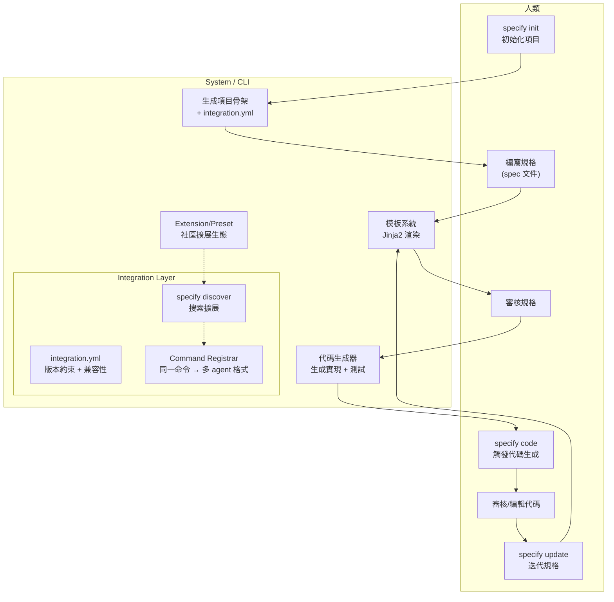

# 5つのLLMコーディングアシスタントワークフローの詳細比較分析

> 分析対象：cc-sdd / Compound Engineering / Superpowers / Trellis / Spec Kit  
> 分析目的：それらがLLMと協調してプロジェクトのコード開発を行う方法を抽出し、新しいワークフロー設計の参考にする  
> 分析日：2026-05-06

---

## 一、分析範囲と方法

### 1.1 研究对象

本分析は `/Users/lienli/Documents/GitHub/vibe-ref/` 下の5つのオープンソースプロジェクトを対象としています。各プロジェクトは「AIコーディングアシスタントのワークフローシステム」であり、スキル、エージェント、コマンド、テンプレートなどのメカニズムを通じて、**LLMと人間の協調方法をオーケストレーション**します。

| プロジェクト | 位置づけ | プラットフォーム対応 | コード行数/複雑さ |
| --- | --- | --- | --- |
| **cc-sdd** | 仕様駆動の長期自律実装システム | 8プラットフォーム | 中程度（複数テンプレート生成） |
| **Compound Engineering** | 複合型エンジニアリングスキルシステム | マルチプラットフォーム（Claude中心） | 最大（50+ agents, 38+ skills） |
| **Superpowers** | スキル駆動開発方法論 | マルチプラットフォーム | 中程度（16 skills） |
| **Trellis** | チームレベルのAIコーディングハーネス | マルチプラットフォーム + CLI | やや大規模（CI + スクリプト + specシステム） |
| **Spec Kit** | 拡張可能なSDDプラットフォームツール | マルチプラットフォーム + Python CLI | 中程度（extensionエコシステム） |

### 1.2 分析の軸

本分析は以下の軸で5つのプロジェクトの協調メカニズムを比較します：

1. **ワークフローオーケストレーション**：「人間 → LLM」の協調フェーズと順序をどのように組織化するか
2. **スキル/能力のカプセル化**：LLMとのインタラクションを再利用可能な能力単位にどのようにカプセル化するか
3. **サブエージェントメカニズム**：サブエージェントを使用してタスクを並列/直列実行する方法
4. **コンテキスト管理**：LLMの限られたコンテキストウィンドウ内でプロジェクト知識を管理する方法
5. **知識蓄積**：1回の作業から学んだ経験を後続で再利用する方法
6. **品質保証**：LLM生成コードの品質を保証する方法
7. **クロスプラットフォーム戦略**：同じワークフローを複数のコーディングアシスタントで実行する方法

---

## 二、コア比較テーブル

### 2.1 ワークフローオーケストレーション

| 軸 | cc-sdd | Compound Engineering | Superpowers | Trellis | Spec Kit |
| --- | --- | --- | --- | --- | --- |
| **エントリポイント** | `/kiro-discovery` | `/ce-brainstorm` または `/ce-ideate` | 自動トリガーされるスキル | 自動トリガー / コマンドトリガー | `specify init` |
| **フェーズ** | Discovery → Spec → Design → Tasks → Impl | Strategy → Ideate → Brainstorm → Plan → Work → Review → Compound | Brainstorm → Plan → Exec → Review → Finish | Plan → Execute → Finish | Requirements → Design → Code → Test |
| **人間の介入ポイント** | 各フェーズで承認 | 各フェーズで承認 / スキップ可能 | 設計承認 + 最終レビュー | taskレベル | フェーズ間承認 |
| **順序強制の有無** | あり（phase gate） | あり（skill chain） | あり（スキル内step） | あり（workflow-state） | あり（フェーズゲート） |
| **例外処理** | auto-debugループ | ce-debug独立スキル | 停止して救援要請 | trellis-break-loop | 未明確 |

### 2.2 スキル/能力のカプセル化

| 軸 | cc-sdd | Compound Engineering | Superpowers | Trellis | Spec Kit |
| --- | --- | --- | --- | --- | --- |
| **カプセル化単位** | SKILL.md | SKILL.md | SKILL.md | コマンド + agents + スクリプト | テンプレート + integration |
| **トリガー方法** | スラッシュコマンド | スラッシュコマンド | 自動マッチング (even 1%) | コマンド + インジェクション | CLIコマンド |
| **依存管理** | steeringドキュメント | referenceファイル | ファイル参照 | JSONLコンテキストインジェクション | extension.yml |
| **合成可能性** | skill → skill呼び出し | skill → agent呼び出し | skill → skill参照 | agent → agentスケジューリング | テンプレート合成 |
| **粒度** | spec/impl/validateレベル | 全機能カバレッジ（細粒度） | フローステップレベル | agentレベル | プロジェクトレベル |

### 2.3 サブエージェントメカニズム

| 軸 | cc-sdd | Compound Engineering | Superpowers | Trellis | Spec Kit |
| --- | --- | --- | --- | --- | --- |
| **スケジューリング方法** | 動的ディスパッチ（スキル内） | 静的agentファイル + 動的スケジューリング | 静的プロンプトテンプレート | 静的agentファイル | N/A（CLIツール） |
| **タスクごとの役割** | Implementer + Reviewer + Debugger | 50以上の専門エージェント | Implementer + Spec Reviewer + Code Reviewer | trellis-implement + trellis-check + trellis-research | N/A |
| **並列戦略** | バッチspec並列作成 | 並列reviewerエージェント | サブエージェント直列 per task | サブエージェントデフォルトディスパッチ | N/A |
| **レビューメカニズム** | 独立reviewer（adversarial） | マルチペルソナ並行レビュー | 2段階レビュー（spec → quality） | trellis-check agent | N/A |
| **失敗再試行** | 最大2ラウンドdebug | ce-debugスキル経由 | BLOCKED + 救援要請 | break-loop agent | N/A |
| **学習伝達** | `## Implementation Notes` in tasks.md | 知識蓄積チェーンに依存 | 未明確 | spec update (Phase 3.3) | N/A |

### 2.4 コンテキスト管理

| 軸 | cc-sdd | Compound Engineering | Superpowers | Trellis | Spec Kit |
| --- | --- | --- | --- | --- | --- |
| **長期記憶** | steeringファイル | docs/solutions/ 学習ノート | docs/superpowers/ plans + specs | .trellis/spec/ 規範システム | specs/ ディレクトリ |
| **セッション記憶** | brief.md + roadmap.md | session inventory | 永続化なし | workspace journal + index | N/A |
| **コンテキストインジェクション** | 動的steering → subagent | 呼び出し時にファイル読み込み | subagentプロンプトテンプレート + 現場情報 | implement.jsonl / check.jsonl | N/A |
| **ワークフロー状態** | spec.jsonメタデータ | スキルSKILL.md内プロトコル | SKILL.md内stepリスト | workflow-state breadcrumbプロトコル | ファイルシステム状態 |
| **現在タスク追跡** | spec statusコマンド | タスクテーブル | TodoWrite | task.py create/start/finish/archive | N/A |

### 2.5 知識蓄積

| 軸 | cc-sdd | Compound Engineering | Superpowers | Trellis | Spec Kit |
| --- | --- | --- | --- | --- | --- |
| **能動的学習** | Implementation Notes伝播 | ce-compound → docs/solutions/ | finishing skillでの振り返り | spec update (Phase 3.3) | テンプレート固定化 |
| **セッション跨ぎ** | steeringファイル | あり（docs/ + 記憶ファイル） | なし | workspace journal + index | N/A |
| **学習タイプ** | 境界/契約エラー | 問題解決（パターン + ソリューション） | 未明確 | 規範（コード規範 + ワークフロー） | テンプレート / ベストプラクティス |
| **リフレッシュメカニズム** | N/A | ce-compound-refresh | N/A | spec update | versioned templates |

---

## 三、各プロジェクトの協調モード詳細分析

### 3.1 cc-sdd：契約駆動の自律実行

#### 核心理念

cc-sddは**spec（仕様）をシステム各部間の契約**として扱い、エージェントへの「命令ドキュメント」とは見なしません。境界内ではエージェントが自由に動作し、境界間は明示的な契約で調整します。

#### 人間とLLMの役割分担



#### フローチャート



#### 主要な設計上の選択

1. **Boundary-First**：`design.md` に `File Structure Plan` を含め、各taskに `_Boundary:_` と `_Depends:_` の注釈を付け、レビューでは境界違反をチェックします（スタイルだけでなく）。
2. **Per-Task 3役割クローズドループ**：各taskが独立してimplementer → reviewer → debugger（必要に応じて）を起動し、コンテキストを共有して汚染することを防ぎます。
3. **学習の伝播**：前のtaskで発見された横断的知識を `tasks.md` の `## Implementation Notes` に書き込み、後続のimplementerプロンプトに注入します。
4. **中断可能な再実行**：毎ラウンド1つのtaskのみ処理し、中断後はブレークポイントから再開するため、進捗が失われません。

#### 欠点

- 仕様作成のコストが高く、迅速なプロトタイピングや単一taskの作業には不向き
- human-in-the-loopへの依存（各フェーズ承認）が特定のシナリオでは過剰
- クロスspec調整が `/kiro-spec-batch` とクロスspecレビューに依存し、複雑さが増す

### 3.2 Compound Engineering：複合型スキルエコシステム

#### 核心理念

**エンジニアリング作業は毎回、後続の作業をより簡単にするべき**であり、難しくするべきではありません。80%を計画とレビューに、20%を実行に充てます。スキルとエージェントの複合効果により、チームの知識が継続的に蓄積されます。

#### 人間とLLMの役割分担



#### フローチャート



### 3.3 Superpowers：プロセス規律駆動の開発方法論

#### 核心理念

Agentはデフォルトで「すぐにコードを書き始める」傾向があります。Superpowersは強制的なスキルアクティベーションとプロセス規律（設計→計画→サブエージェント実行→レビュー）を通じて、この行動を防ぎます。

#### 人間とLLMの役割分担



#### フローチャート



### 3.4 Trellis：チームレベルのコンテキストとタスク管理システム

#### 核心理念

構造化ファイルシステムでLLMの限られたコンテキストウィンドウを補完します。`.trellis/` ディレクトリにすべてのプロジェクト知識を保存し、breadcrumbプロトコルとJSONLインジェクションを通じて、エージェントにオンデマンドでコンテキストを提供します。

#### 人間とLLMの役割分担



#### フローチャート



### 3.5 Spec Kit：拡張可能なSDDプラットフォームツール

#### 核心理念

**仕様駆動開発（SDD）のプラットフォーム化**。Specifications become executable——仕様は単なるガイドではなく、直接動作する実装を生成します。核となるのは `specify` CLIツールと拡張可能なextension/presetシステムです。

#### 人間とLLMの役割分担



#### フローチャート



---

## 四、コア設計トレードオフの比較

### 4.1 プロセスの剛性 vs 柔軟性

| 柔軟（プロセスなし） | | | 剛（高度に構造化） |
| Spec Kit (CLI ツール) | Superpowers (スキル強制) / Trellis (状態機械) | Compound (柔軟なskill chain) | cc-sdd (phase gate) |

- **cc-sdd** が最も剛：discovery → spec → design → tasks → impl、各フェーズで承認が必要、-yなしではスキップ不可
- **Superpowers** はスキルを強制するが、スキル内のステップは自主的に柔軟
- **Compound Engineering** は完全なskill chainを提供するが、任意のポイントから開始可能
- **Trellis** はworkflow-stateプロトコルでガイドするが、inline overrideの逃げ道を提供
- **Spec Kit** はCLIツールであり、プロセスはユーザーが制御

### 4.2 コンテキスト管理の複雑さ

| 永続化なし | ファイルシステムベース | 完全永続化 + 状態機械 |
| Superpowers | cc-sdd / Compound (中程度) | Trellis (最高) |

- **Superpowers** は完全にsubagentプロンプトテンプレートに依存し、セッション跨ぎの記憶なし
- **cc-sdd** はsteeringファイルとImplementation Notesで知識を伝達
- **Compound Engineering** はdocs/solutions/とメモリシステムで知識を管理
- **Trellis** は `.trellis/` ディレクトリ、workspace journal、jsonlコンテキスト、breadcrumbプロトコルで最も完全な永続化を管理

### 4.3 サブエージェントの複雑さ

| サブエージェントなし | 単純なサブエージェント | 複雑なagentシステム |
| Spec Kit | Superpowers (3役割) | cc-sdd (3役割) / Compound Engineering (50+ agents) / Trellis (3 agents + スクリプト) |

- **Compound Engineering** がエージェント数最多（50+）だが、ほとんどはcode reviewシナリオ用
- **cc-sdd** と **Superpowers** はいずれもper-taskで3役割（implementer + reviewer + debug/quality）
- **Trellis** は3つのサブエージェントを使い、スクリプトで補助
- サブエージェントが増えるほど、コンテキスト伝達と調整のオーバーヘッドが大きくなる

### 4.4 知識蓄積メカニズム

| 蓄積なし | 単方向蓄積 | クローズドループ蓄積 + リフレッシュ |
| Superpowers | cc-sdd | Trellis (spec update) | Compound Engineering (ce-compound + refresh) |

- **Compound Engineering** の `ce-compound` + `ce-compound-refresh` の組み合わせは唯一**知識の経年劣化検出**を持つシステム
- **Trellis** の `spec update` はPhase 3.3で必須であり、実行から学んだ規範を `.trellis/spec/` に書き戻す
- **cc-sdd** のImplementation Notesは単一セッション内でのみ伝達
- **Superpowers** には知識蓄積メカニズムなし

---

## 五、新しいワークフロー設計への示唆

### 5.1 借鉴すべき主要メカニズム

| メカニズム | 出典 | 借鉴すべき理由 |
| --- | --- | --- |
| **workflow-state breadcrumbプロトコル** | Trellis | 最も軽量な方法（テキストラベル）で状態認識を実現、agentが状態機械を保守する必要なし |
| **Boundary-Firstタスク分割** | cc-sdd | agentが単一セッションでコンテキスト汚染される問題を解決する核心手段 |
| **Even 1%スキルアクティベーション** | Superpowers | agentが「すぐに書き始める」のを防ぐ効果的なメカニズム |
| **マルチペルソナ並行code review** | Compound Engineering | 異なる視点でagentコードの単一視点の盲点をカバー |
| **JSONLコンテキストインジェクション** | Trellis | メインスレッドにspec詳細をロードせず、サブエージェントが必要に応じて取得 |
| **タスクごとの3役割クローズドループ** | cc-sdd / Superpowers | 実装 + review + debugの分離により品質を保証 |
| **ドキュメント複合（compound）システム** | Compound Engineering | 経年劣化検出がある知識蓄積が真に持続的に機能する |
| **クロスプラットフォームスキルテンプレート** | cc-sdd / Compound | 同じワークフローを複数のコーディングアシスタントに適応 |

### 5.2 避けるべき落とし穴

| 落とし穴 | 出典 | 説明 |
| --- | --- | --- |
| **過剰な状態管理** | Trellis | 状態機械の複雑さがagentの理解齟齬を引き起こす可能性（4状態 + 5フェーズ + 3ステップタイプ） |
| **スキル数の過剰増加** | Compound Engineering | 50+ agentsがメンテナンスコストとユーザーの混乱を増加 |
| **永続化のないプロセス** | Superpowers | セッション跨ぎで知識が蓄積されず、毎回ゼロから開始 |
| **仕様作成コストの高さ** | cc-sdd | 小規模な変更には完全なspecプロセスに見合わない |
| **すべての変更に完全プロセスを強制** | Superpowers | "This Is Too Simple To Need A Design"のアンチパターンは正しいがプロトタイピング速度を低下させる可能性 |

### 5.3 「理想的なワークフロー」の主要特性

5つのプロジェクトの分析を総合すると、新しいワークフローは以下の特性を持つべきです：

1. **状態は明示的だが軽量**：テキストラベル/ファイルシステム状態を使用し、複雑な状態機械は使わない
2. **段階的プロセス**：「即時実行」から「完全spec」まで必要に応じて有効化し、一律ではない
3. **サブエージェントの分離**：各サブエージェントが独立したコンテキストを持ち、コンテキスト汚染を回避
4. **知識にライフサイクル**：蓄積(compound) → 使用(work) → リフレッシュ(refresh) → 廃棄(archive)
5. **人間は重要なノードでのみ介入**：設計承認、受入レビュー。行単位のコードレビューではない
6. **中断復旧のサポート**：各ステップの操作を永続化し、中断後はブレークポイントから続行
7. **可観測性**：agentが何を、なぜ、どのような状態で行っているかをファイルから追跡可能

### 5.4 推奨するワークフローメタモデル

```
┌─────────────────────────────────────────────────────────────────┐
│                    戦略層（セッション跨ぎ）                          │
│  ┌──────────┐    ┌──────────┐    ┌──────────┐                  │
│  │ STRATEGY │◄──►│ LEARNINGS│◄──►│ STANDARDS│                  │
│  │ .md      │    │ docs/    │    │ .trellis/│                  │
│  └──────────┘    └──────────┘    └──────────┘                  │
└─────────────────────────────────────────────────────────────────┘
                            │ 読み込み
┌─────────────────────────────────────────────────────────────────┐
│                    実行層（単一セッション）                          │
│                                                                  │
│  入口判定 ←──────── ユーザー入力                                   │
│    │                                                             │
│    ├── 直接変更（小修正）→ TDD → review → commit                    │
│    │                                                             │
│    ├── 規範開発：要件明確化 → 計画 → task分解                       │
│    │              → per-task [impl → review] ループ                │
│    │              → 統合検証 → commit                              │
│    │                                                             │
│    └── デバッグモード：再現 → 因果連鎖トレース → fix → 検証          │
│                                                                  │
│  各ステップの状態をファイルシステムに永続化（中断再開可能）            │
└─────────────────────────────────────────────────────────────────┘
                            │ 学習
┌─────────────────────────────────────────────────────────────────┐
│                    蓄積層（ポストセッション）                        │
│  ┌──────────┐    ┌──────────┐    ┌──────────┐                  │
│  │ 複合沈澱   │──►│ 定期刷新   │──►│ 歸檔/廢棄 │                  │
│  │ compound │    │ refresh  │    │ archive  │                  │
│  └──────────┘    └──────────┘    └──────────┘                  │
└─────────────────────────────────────────────────────────────────┘
```

---

## 六、結論

### 6.1 各プロジェクトの独自の貢献

- **cc-sdd**：「仕様 = 契約」の哲学を最も明確に示し、AI生成コードの調整問題を解決
- **Compound Engineering**：最も完全なスキルエコシステム、strategy → pulseのクローズドループでフライホイール駆動を実現
- **Superpowers**：プロセス規律を最も重視、「Even 1%」ルールはエージェントの「すぐに書き始める」衝動に対抗する効果的な手段
- **Trellis**：最も完成度の高いコンテキスト管理ソリューション、breadcrumbプロトコル + JSONLインジェクション + workspace journalの組み合わせは深く参考にする価値がある
- **Spec Kit**：唯一のプラットフォームエコシステム化アプローチ、extension/presetメカニズムでSDDツールを拡張可能に

### 6.2 核心的な洞察

> **LLMコーディングアシスタントワークフローの核心的な矛盾は、プロセス規律が品質を向上させるが摩擦を増加させ、自由度が速度を向上させるが制御可能性を低下させることです。**

5つのプロジェクトはすべて異なるバランス点を模索しています。「最善」のソリューションは存在せず、特定のチームとプロジェクトタイプに適したソリューションがあるのみです。

- 個人のプロトタイプ：Superpowersの軽量スキルチェーンが最も適している可能性
- 中規模チーム：Compound Engineeringの完全なエコシステムが最も包括的
- 長期実行が必要なチーム：cc-sddの境界優先 + 自律実行が最も適している
- チーム標準化：Trellisのコンテキストと規範管理システムが最も成熟
- コード生成ツールチェーン：Spec Kitのテンプレートプラットフォームが最も拡張性が高い

### 6.3 次のアクション

本分析の出力は `vibe-workflow` の設計にインプットされます。具体的なパス：

1. 「コアワークフローメタモデル」の抽出（5.4参照）
2. 状態プロトコルの決定（Trellis breadcrumbを参考にするが、より軽量に）
3. サブエージェントスケジューリング戦略の設計（cc-sddのper-task 3役割 + Compoundのマルチペルソナレビューを参考に）
4. 知識蓄積システムの設計（Compoundのcompound + refreshメカニズムを参考に）
5. クロスプラットフォーム適応レイヤーの構築（cc-sddとCompoundのクロスプラットフォームテンプレート生成を参考に）