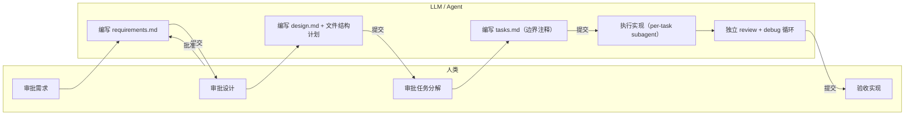
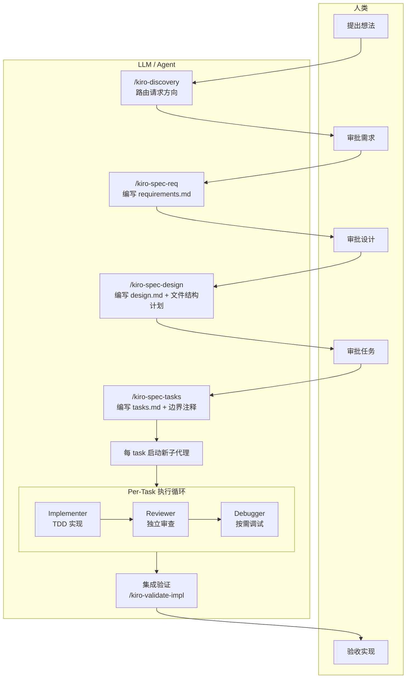
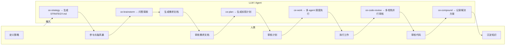
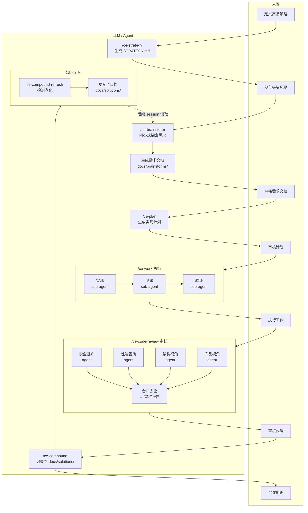
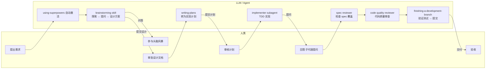
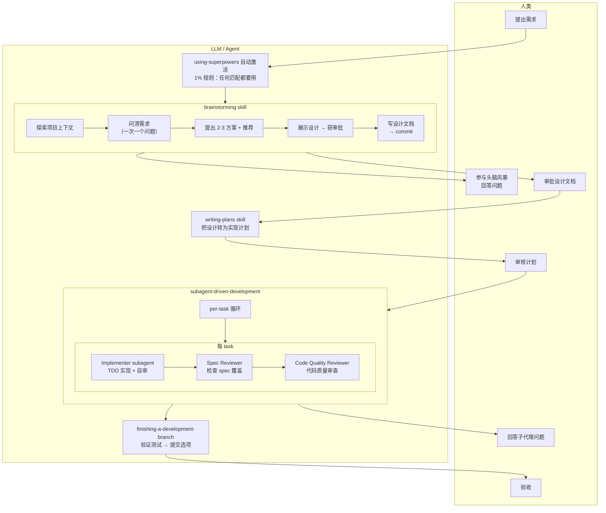
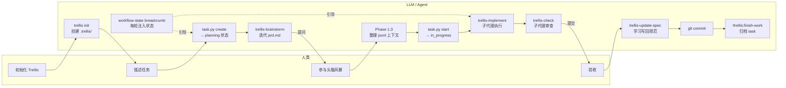
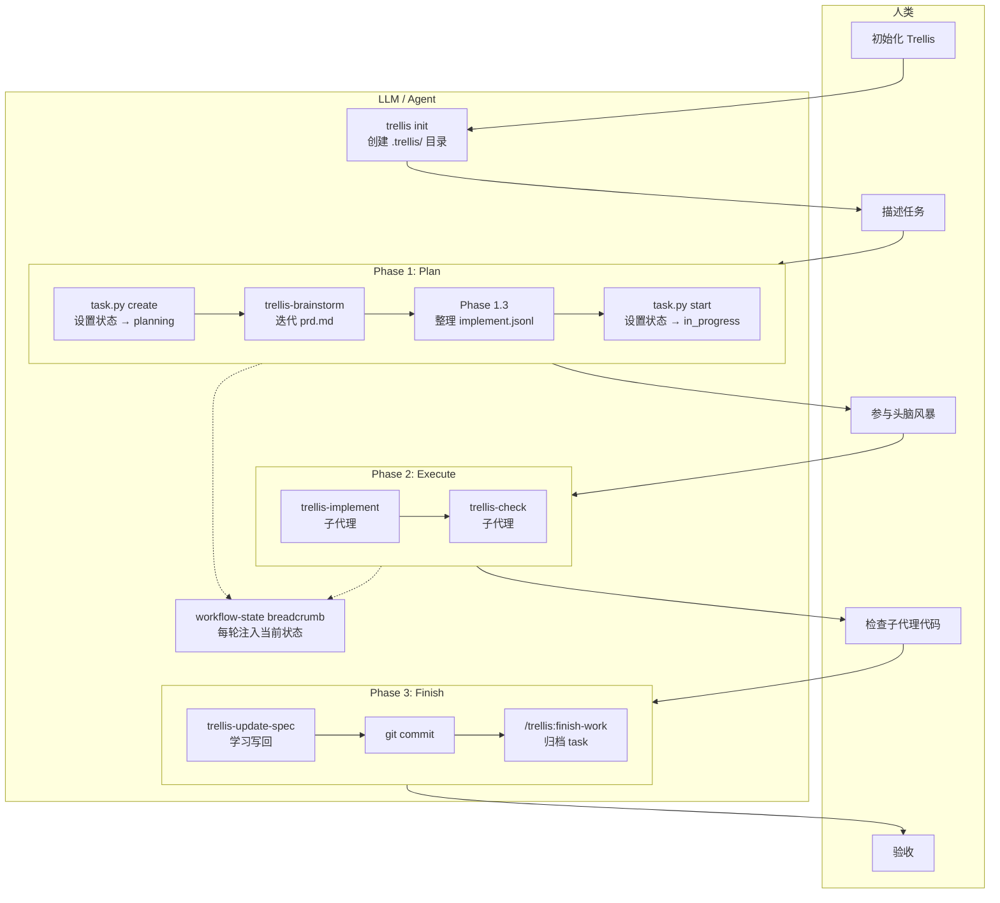
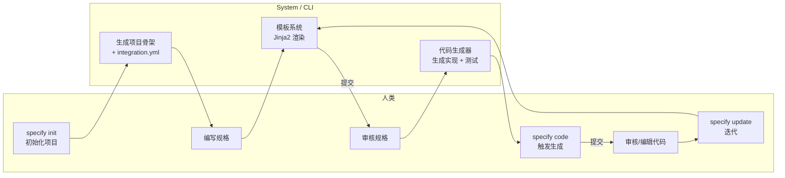
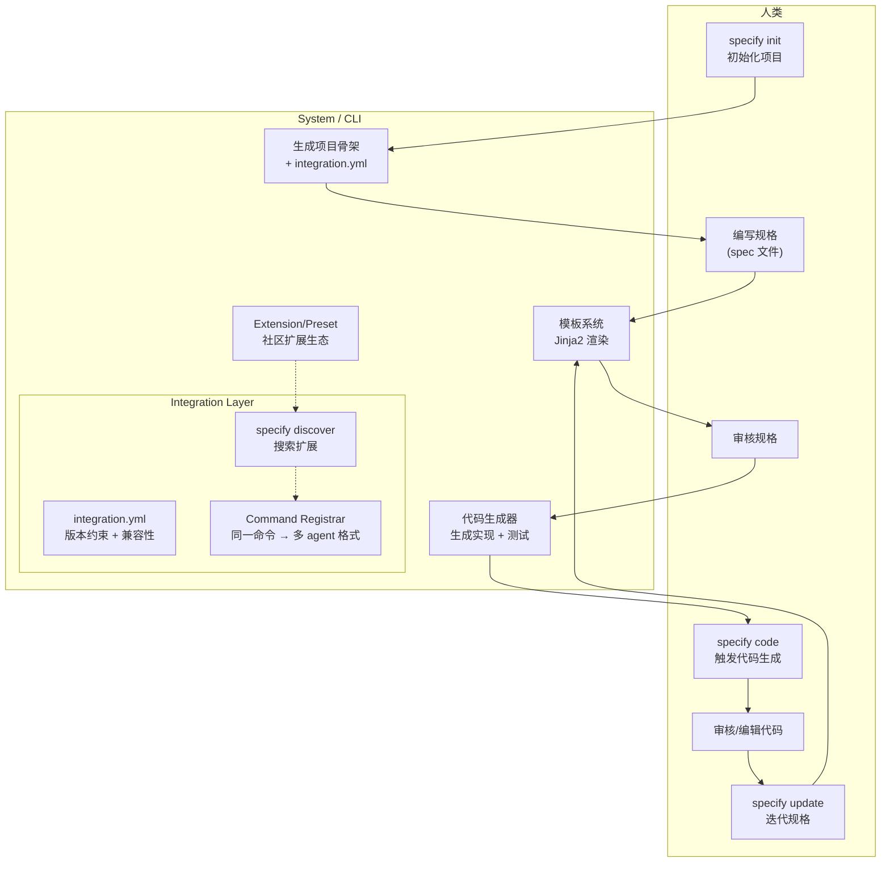

# 五个 LLM 编码助理工作流的深度对比分析

> 分析对象：cc-sdd / Compound Engineering / Superpowers / Trellis / Spec Kit  
> 分析目标：提炼它们如何协作 LLM 进行项目代码开发，为设计新工作流提供参考  
> 分析日期：2026-05-06

---

## 一、分析范围与方法

### 1.1 研究对象

本分析涵盖 `/Users/lienli/Documents/GitHub/vibe-ref/` 下的五个开源项目，每个项目都是"AI 编码助理的工作流系统"——它们通过技能(skills)、代理(agents)、命令(commands)、模板(templates)等机制，**编排 LLM 与人类的协作方式**。

| 项目 | 定位 | 平台覆盖 | 代码行数/复杂度 |
| --- | --- | --- | --- |
| **cc-sdd** | 规格驱动的长周期自治实现系统 | 8 平台 | 中等（多模板生成） |
| **Compound Engineering** | 复合型工程技能系统 | 多平台（Claude 主） | 最大（50+ agents, 38+ skills） |
| **Superpowers** | 技能驱动开发方法学 | 多平台 | 中等（16 skills） |
| **Trellis** | 团队级 AI coding harness | 多平台 + CLI | 较大（CI + 脚本 + spec 系统） |
| **Spec Kit** | 可扩展 SDD 平台化工具 | 多平台 + Python CLI | 中等（extension 生态） |

### 1.2 分析维度

本分析从以下维度对比五个项目的协作机制：

1. **工作流编排**：如何组织"人类 → LLM"协作的阶段与顺序
2. **技能/能力封装**：如何把 LLM 交互封装成可复用的能力单元
3. **子代理机制**：如何使用子代理并行/串联任务
4. **上下文管理**：如何在 LLM 有限上下文窗口中管理项目知识
5. **知识积累**：如何从一次工作中学到经验供后续复用
6. **质量保障**：如何在 LLM 生成代码中保障质量
7. **跨平台策略**：如何让同一个工作流在多个编码助理上运行

---

## 二、核心对比表格

### 2.1 工作流编排

| 维度 | cc-sdd | Compound Engineering | Superpowers | Trellis | Spec Kit |
| --- | --- | --- | --- | --- | --- |
| **入口** | `/kiro-discovery` | `/ce-brainstorm` 或 `/ce-ideate` | 自动触发 skills | 自动触发 / 命令触发 | `specify init` |
| **阶段** | Discovery → Spec → Design → Tasks → Impl | Strategy → Ideate → Brainstorm → Plan → Work → Review → Compound | Brainstorm → Plan → Exec → Review → Finish | Plan → Execute → Finish | Requirements → Design → Code → Test |
| **人类介入点** | 每阶段审批 | 每阶段审批 / 可跳过 | 设计审批 + 最终 review | task 级别 | 阶段间审批 |
| **是否强制顺序** | 是（phase gate） | 是（skill chain） | 是（skill 内 step） | 是（workflow-state） | 是（阶段门） |
| **异常处理** | auto-debug 循环 | ce-debug 独立 skill | 停止并求援 | trellis-break-loop | 未明确 |

### 2.2 技能/能力封装

| 维度 | cc-sdd | Compound Engineering | Superpowers | Trellis | Spec Kit |
| --- | --- | --- | --- | --- | --- |
| **封装单元** | SKILL.md | SKILL.md | SKILL.md | 命令 + agents + 脚本 | 模板 + integration |
| **触发方式** | 斜杠命令 | 斜杠命令 | 自动匹配 (even 1%) | 命令 + 注入 | CLI 命令 |
| **依赖管理** | steering 文档 | reference 文件 | 文件引用 | JSONL 上下文注入 | extension.yml |
| **可组合性** | skill → skill 调用 | skill → agent 调用 | skill → skill 引用 | agent → agent 调度 | 模板组合 |
| **粒度** | spec/impl/validate 级别 | 全功能覆盖（细粒度） | 流程步骤级 | agent 级别 | 项目级别 |

### 2.3 子代理机制

| 维度 | cc-sdd | Compound Engineering | Superpowers | Trellis | Spec Kit |
| --- | --- | --- | --- | --- | --- |
| **调度方式** | 动态 dispatch（skill 内） | 静态 agent 文件 + 动态调度 | 静态 prompt 模板 | 静态 agent 文件 | N/A（CLI 工具） |
| **每任务角色** | Implementer + Reviewer + Debugger | 50+ 专职 agents | Implementer + Spec Reviewer + Code Reviewer | trellis-implement + trellis-check + trellis-research | N/A |
| **并行策略** | 批量 spec 并行创建 | 并行 reviewer agents | 子代理串行 per task | 子代理默认 dispatch | N/A |
| **review 机制** | 独立 reviewer（adversarial） | 多 persona 并行 review | 两步 review（spec → quality） | trellis-check agent | N/A |
| **失败重试** | 最大 2 轮 debug | 通过 ce-debug skill | BLOCKED + 求援 | break-loop agent | N/A |
| **学到传递** | `## Implementation Notes` in tasks.md | 依赖知识积累链 | 未明确 | spec update (Phase 3.3) | N/A |

### 2.4 上下文管理

| 维度 | cc-sdd | Compound Engineering | Superpowers | Trellis | Spec Kit |
| --- | --- | --- | --- | --- | --- |
| **长期记忆** | steering 文件 | docs/solutions/ 学习笔记 | docs/superpowers/ plans + specs | .trellis/spec/ 规范系统 | specs/ 目录 |
| **会话记忆** | brief.md + roadmap.md | session inventory | 无持久化 | workspace journal + index | N/A |
| **上下文注入** | 动态 steering → subagent | 调用时文件读取 | subagent prompt 模板 + 现场信息 | implement.jsonl / check.jsonl | N/A |
| **工作流状态** | spec.json 元数据 | skill SKILL.md 内协议 | SKILL.md 内 step list | workflow-state breadcrumb 协议 | 文件系统状态 |
| **当前任务追踪** | spec status 命令 | 任务表 | TodoWrite | task.py create/start/finish/archive | N/A |

### 2.5 知识积累

| 维度 | cc-sdd | Compound Engineering | Superpowers | Trellis | Spec Kit |
| --- | --- | --- | --- | --- | --- |
| **主动学习** | Implementation Notes 传播 | ce-compound → docs/solutions/ | 复盘在 finishing skill | spec update (Phase 3.3) | 模板固化 |
| **跨 session** | steering 文件 | 是（docs/ + 记忆文件） | 否 | workspace journal + index | N/A |
| **学习类型** | 边界/契约错误 | 问题解决（模式 + 解决方案） | 未明确 | 规范（代码规范 + 工作流） | 模板 / 最佳实践 |
| **刷新机制** | N/A | ce-compound-refresh | N/A | spec update | versioned templates |

---

## 三、各项目协作模式详细分析

### 3.1 cc-sdd：契约驱动的自治执行

#### 核心理念

cc-sdd 把 **spec（规格）当作系统各部分之间的契约**，而不是给 agent 的"命令文档"。在边界之内 agent 自由发挥，在边界之间靠显式契约协调。

#### 人类与 LLM 的职责划分



#### 流程图



#### 关键设计选择

1. **Boundary-First**：`design.md` 包含 `File Structure Plan`，每个 task 带 `_Boundary:_` 和 `_Depends:_` 注释，review 检查边界违反（不仅检查风格）。
2. **Per-Task 三角色闭环**：每个 task 独立启动 implementer → reviewer → debugger（按需），不共享上下文以免污染。
3. **学到的传播**：前一 task 发现的跨切面知识写入 `tasks.md` 的 `## Implementation Notes`，注入后序 implementer prompt。
4. **可中断重跑**：每轮只处理 1 个 task，中断后重跑从断点继续，不会丢失进度。

#### 不足

- 规格编写成本高，不适合快速原型或单 task 工作
- 对 human-in-the-loop 的依赖（每阶段审批）在某些场景过多
- 跨 spec 协调依赖 `/kiro-spec-batch` 和 cross-spec review，增加了复杂度

### 3.2 Compound Engineering：复合型技能生态系统

#### 核心理念

**每次工程工作都应该让后续工作更容易**，而不是更难。80% 在规划与审核，20% 在执行。技能和 agent 的复合效应使团队知识持续累积。

#### 人类与 LLM 的职责划分



#### 流程图



### 3.3 Superpowers：流程纪律驱动的开发方法学

#### 核心理念

Agent 默认会"直接开写代码"——Superpowers 通过强制技能激活和流程纪律（先设计 → 再计划 → 再子代理执行 → 再审核），防止这种行为。

#### 人类与 LLM 的职责划分



#### 流程图



### 3.4 Trellis：团队级上下文与任务管理系统

#### 核心理念

用结构化文件系统替代 LLM 的有限上下文窗口。`.trellis/` 目录保存所有项目知识，通过 breadcrumb 协议和 JSONL 注入为 agent 提供按需加载的上下文。

#### 人类与 LLM 的职责划分



#### 流程图



### 3.5 Spec Kit：可扩展的 SDD 平台工具

#### 核心理念

**规格驱动开发（SDD）平台化**。Specifications become executable——规格不只是指导，而是直接生成可工作的实现。核心是 `specify` CLI 工具和可扩展的 extension/preset 系统。

#### 人类与 LLM 的职责划分



#### 流程图



---

## 四、核心设计取舍对比

### 4.1 流程刚度 vs 灵活性

| 灵活（无流程） | | | 刚（高度结构化） |
| Spec Kit (CLI 工具) | Superpowers (强制 skill) / Trellis (状态机) | Compound (灵活 skill chain) | cc-sdd (phase gate) |

- **cc-sdd** 最刚：discovery → spec → design → tasks → impl，每阶段需审批，无 -y 不能跳过
- **Superpowers** 强制 skill 但 skill 内步数可自主灵活
- **Compound Engineering** 提供完整 skill chain 但允许从任意点进入
- **Trellis** 靠 workflow-state 协议引导，但提供了 inline override 逃生口
- **Spec Kit** 是 CLI 工具，流程由用户控制

### 4.2 上下文管理复杂度

| 无持久化 | 文件系统基础 | 完备持久化 + 状态机 |
| Superpowers | cc-sdd / Compound (中等) | Trellis (最高) |

- **Superpowers** 完全依赖 subagent prompt 模板，无跨 session 记忆
- **cc-sdd** 用 steering 文件和 Implementation Notes 传递知识
- **Compound Engineering** 通过 docs/solutions/ 和内存系统管理知识
- **Trellis** 用 `.trellis/` 目录、workspace journal、jsonl 上下文、breadcrumb 协议管理最完整的持久化

### 4.3 子代理复杂度

| 无子代理 | 简单子代理 | 复杂 agent 系统 |
| Spec Kit | Superpowers (3 角色) | cc-sdd (3 角色) / Compound Engineering (50+ agents) / Trellis (3 agents + 脚本) |

- **Compound Engineering** agent 数量最多（50+），但大多数用于 code review 的场景
- **cc-sdd** 和 **Superpowers** 都用 3 角色 per-task（implementer + reviewer + debug/quality）
- **Trellis** 用 3 个子代理并靠脚本辅助
- 子代理越多，上下文传递和协调的开销越大

### 4.4 知识积累机制

| 无积累 | 单向积累 | 闭环积累 + 刷新 |
| Superpowers | cc-sdd | Trellis (spec update) | Compound Engineering (ce-compound + refresh) |

- **Compound Engineering** 的 `ce-compound` + `ce-compound-refresh` 组合是唯一有**知识老化检测**的系统
- **Trellis** 的 `spec update` 在 Phase 3.3 是 required，将执行中学到的规范写回 `.trellis/spec/`
- **cc-sdd** 的 Implementation Notes 只在单次 session 内传递
- **Superpowers** 无知识积累机制

---

## 五、对新工作流设计的启示

### 5.1 值得借鉴的关键机制

| 机制 | 来源 | 值得借鉴的原因 |
| --- | --- | --- |
| **workflow-state breadcrumb 协议** | Trellis | 以最轻量的方式（文本标签）实现状态感知，agent 无需维护状态机 |
| **Boundary-First 任务切分** | cc-sdd | 解决 agent 在单 session 中被上下文污染的核心手段 |
| **Even 1% 技能激活** | Superpowers | 防止 agent "直接开写"的有效机制 |
| **多 persona 并行 code review** | Compound Engineering | 用不同视角覆盖 agent 代码的单视角盲区 |
| **JSONL 上下文注入** | Trellis | 让主线程不加载 spec 细节，子代理按需获取 |
| **每 task 三角色闭环** | cc-sdd / Superpowers | 实现 + review + debug 分离，质量有保障 |
| **文档复合（compound）系统** | Compound Engineering | 有老化检测的知识积累才能真正持久生效 |
| **跨平台技能模板** | cc-sdd / Compound | 同一工作流适配多编码助理 |

### 5.2 需要避免的陷阱

| 陷阱 | 来源 | 说明 |
| --- | --- | --- |
| **过度状态管理** | Trellis | 状态机复杂度可能导致 agent 理解偏差（4 状态 + 5 phase + 3 step type） |
| **技能数量膨胀** | Compound Engineering | 50+ agents 增加维护成本和用户困惑 |
| **无持久化的流程** | Superpowers | 跨 session 知识不积累，每次从零开始 |
| **规格编写成本过高** | cc-sdd | 小型变更不值得完整的 spec 流程 |
| **强制所有变更走完整流程** | Superpowers | "This Is Too Simple To Need A Design" 的反模式虽正确但可能降低原型速度 |

### 5.3 "理想工作流"的关键特征

综合五个项目的分析，一个新工作流应该具备以下特征：

1. **状态显式但轻量**：用文本标签/文件系统状态，而非复杂状态机
2. **渐进式流程**：从"立即执行"到"完整 spec"按需启用，而非一刀切
3. **子代理隔离**：每个子代理有独立上下文，避免上下文污染
4. **知识有生命周期**：积累(compound) → 使用(work) → 刷新(refresh) → 废弃(archive)
5. **人类在关键节点介入**：设计审批、验收审核，而非逐行代码 review
6. **支持中断恢复**：每步操作可持久化，中断后从断点继续
7. **可观测性**：agent 做什么、为什么、状态如何，都能从文件中追溯

### 5.4 推荐的工作流元模型

```
┌─────────────────────────────────────────────────────────────────┐
│                    战略层（跨 session）                            │
│  ┌──────────┐    ┌──────────┐    ┌──────────┐                  │
│  │ STRATEGY │◄──►│ LEARNINGS│◄──►│ STANDARDS│                  │
│  │ .md      │    │ docs/    │    │ .trellis/│                  │
│  └──────────┘    └──────────┘    └──────────┘                  │
└─────────────────────────────────────────────────────────────────┘
                            │ 读取
┌─────────────────────────────────────────────────────────────────┐
│                    执行层（单 session）                            │
│                                                                  │
│  入口判断 ←──────── 用户输入                                      │
│    │                                                             │
│    ├── 直接变更（小修改）→ TDD → review → commit                   │
│    │                                                             │
│    ├── 规范开发：需求澄清 → 计划 → task 拆解                       │
│    │              → per-task [impl → review] 循环                  │
│    │              → 集成验证 → commit                             │
│    │                                                             │
│    └── 调试模式：复现 → 因果链追溯 → fix → 验证                    │
│                                                                  │
│  每步状态持久化到文件系统（中断可恢复）                              │
└─────────────────────────────────────────────────────────────────┘
                            │ 学习
┌─────────────────────────────────────────────────────────────────┐
│                    积累层（post-session）                          │
│  ┌──────────┐    ┌──────────┐    ┌──────────┐                  │
│  │ 复合沉淀   │──►│ 定期刷新   │──►│ 归档/废弃 │                  │
│  │ compound │    │ refresh  │    │ archive  │                  │
│  └──────────┘    └──────────┘    └──────────┘                  │
└─────────────────────────────────────────────────────────────────┘
```

---

## 六、结论

### 6.1 每个项目的独特贡献

- **cc-sdd**：最清晰地阐述了"规格 = 契约"的哲学，解决了 AI 生成代码的协调问题
- **Compound Engineering**：最完整的技能生态系统，strategy→pulse 闭环让飞轮驱动成为可能
- **Superpowers**：最强调流程纪律，"Even 1%" 规则是对付 agent "直接开写"冲动的有效手段
- **Trellis**：最完备的上下文管理方案，breadcrumb 协议 + JSONL 注入 + workspace journal 的组合值得深入参考
- **Spec Kit**：唯一的平台生态化思路，extension/preset 机制让 SDD 工具可扩展

### 6.2 核心洞见

> **LLM 编码助理工作流的核心矛盾是：流程纪律能提升质量，但增加摩擦；自由度能提升速度，但降低可控性。**

五个项目都在寻找不同的平衡点。没有"最佳"方案，只有适合特定团队和项目类型的方案。

- 对单人原型：Superpowers 的轻量技能链可能最合适
- 对中等团队：Compound Engineering 的完整生态系统最全面
- 对需要长周期执行的团队：cc-sdd 的边界优先 + 自治执行最合适
- 对团队标准化：Trellis 的上下文与规范管理系统最成熟
- 对代码生成工具链：Spec Kit 的模板平台最具扩展性

### 6.3 下一步行动

本分析的输出将输入到 `vibe-workflow` 的设计中，具体路径：

1. 提炼"核心工作流元模型"（见 5.4）
2. 确定状态协议（借鉴 Trellis breadcrumb，但更轻量）
3. 设计子代理调度策略（借鉴 cc-sdd 的 per-task 三角色 + Compound 的多 persona review）
4. 设计知识积累系统（借鉴 Compound 的 compound + refresh 机制）
5. 构建跨平台适配层（借鉴 cc-sdd 和 Compound 的跨平台模板生成）