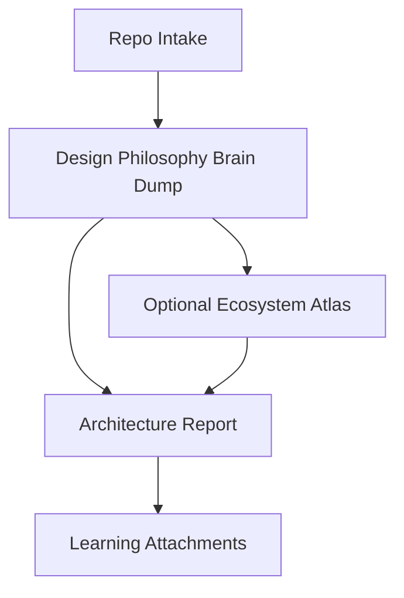

# 示例源码解读

下面这份示例不是为了展示“格式多完整”，而是为了展示 `arch-insight` 想要的判断力度：先说明系统为什么这样设计，再解释哪些抽象最值得学、主流程最能说明什么、取舍的代价在哪里。

## 项目定位

这个项目表面上是一个命令行工具，本质上是在解决“如何把多来源上下文压缩成可复用的研究路径”这个问题。它的重点不在命令数量，而在于如何把 intake、脑图分析、正式报告和知识沉淀拆成清晰阶段。

## 最值得学习的抽象

1. `intake`：先判断边界，再决定深挖范围，避免一上来就全仓漫游。
2. `brain dump`：先建立系统脑图，再形成正式结论，让观察和判断分层。
3. `artifact split`：把主报告和学习附件拆开，避免一份长文承担所有职责。

## 主流程

用户先通过 intake 确定研究对象、项目类型和最值得先看的入口；随后 design philosophy brain dump 不按目录平铺，而是追踪最能体现系统哲学的主流程，识别核心抽象和设计原则；如果单仓视角不足，再补 ecosystem atlas；最后 architecture report 把这些观察重组为一份带判断力的解读，并拆出设计理念、主流程、取舍和借鉴模式等附件。

## 设计取舍示例

### 取舍 1：单仓默认路径 vs 默认生态级分析

当前方案默认只服务单仓源码思想解读，收益是上手轻、问题聚焦、适合团队工程师日常研究；代价是面对平台型系统时需要显式升级路径。替代方案是默认把生态层也纳入流程，但那会让大多数普通仓库分析变重。这个取舍合理，因为它优先优化了最高频的学习场景。

### 取舍 2：主报告 + 学习附件 vs 一份全能总报告

当前方案把正式叙事和学习资产拆开，收益是每份产物回答的问题更清晰，后续复用也更强；代价是需要维护多份模板。替代方案是把所有内容都塞进一份报告，但那会让“真正值得记住的思想”埋在长文里。这个取舍更适合团队知识沉淀。

## 风险提醒

最大的风险不是内容太少，而是各层文档重新长出第二套故事。只要 `README.md`、`SKILL.md`、`RUNNER.md` 和 `prompts/` 讲的不是同一个默认路径，这个 skill 就会重新变回“看起来什么都能做、实际上没人知道该怎么用”的状态。

## 总体评价

这套工作流最值得学习的是它如何把“研究源码”收束成一条明确的学习路径；最值得警惕的是默认故事漂移，一旦阶段命名、产物命名和产品定位不同步，整个仓库会很快失去可发现性和复用价值。
